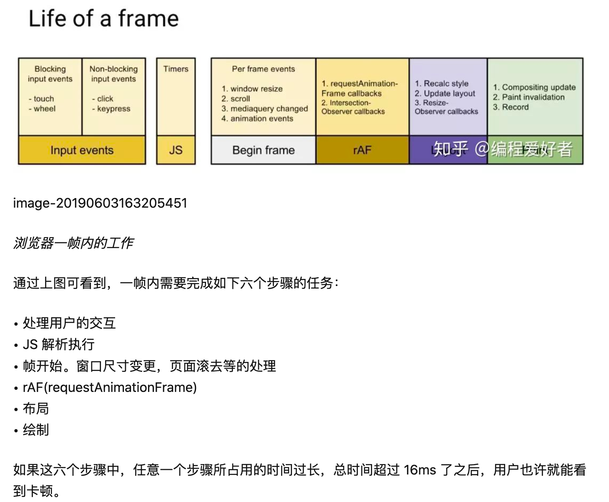
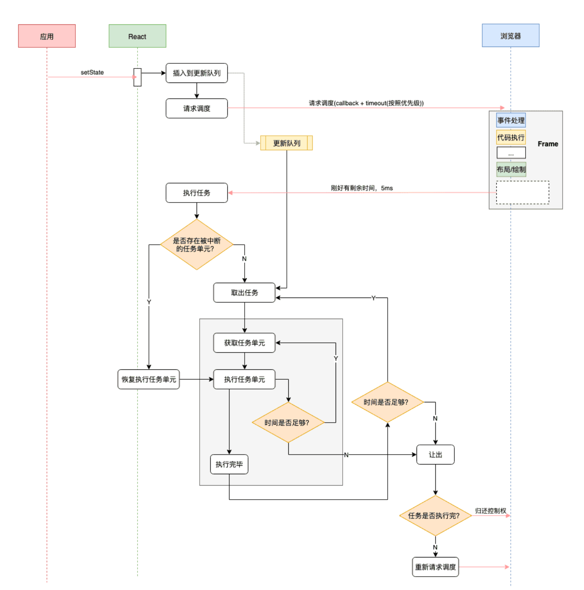
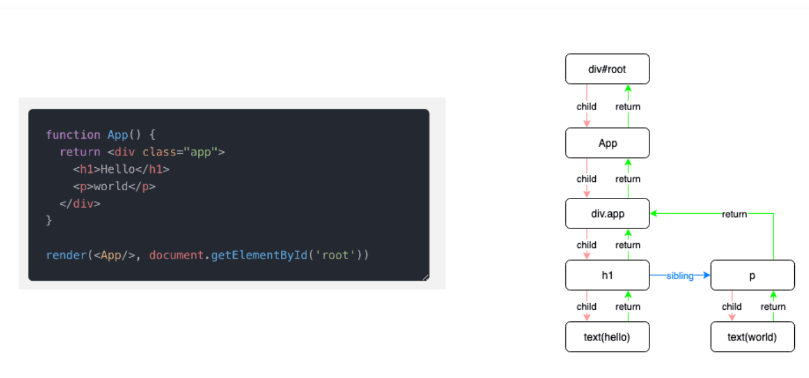

## **React 的核心思想**

**内存中维护一颗虚拟DOM树，数据变化时（setState），自动更新虚拟 DOM，得到一颗新树，然后 Diff 新老虚拟 DOM  树，找到有变化的部分，得到一个 Change(Patch)，将这个 Patch  加入队列，最终批量更新这些 Patch 到 DOM 中**。


React 16 之前：

首先我们了解一下 React 的工作过程，当我们通过`render()`和 `setState()` 进行组件渲染和更新的时候，React 主要有两个阶段：

**调和阶段(Reconciler)：**官方解释。React 会自顶向下通过递归，遍历新数据生成新的 Virtual DOM，然后通过 Diff 算法，找到需要变更的元素(Patch)，放到更新队列里面去。

**渲染阶段(Renderer)**：遍历更新队列，通过调用宿主环境的API，实际更新渲染对应元素。宿主环境，比如 DOM、Native、WebGL 等。

在协调阶段阶段，由于是采用的递归的遍历方式，这种也被成为 **Stack Reconciler**，主要是为了区别 **Fiber Reconciler** 取的一个名字。这种方式有一个特点：一旦任务开始进行，就**无法中断**，那么 js 将一直占用主线程， 一直要等到整棵 Virtual DOM 树计算完成之后，才能把执行权交给渲染引擎，那么这就会导致一些用户交互、动画等任务无法立即得到处理，就会有卡顿，非常的影响用户体验。


浏览器是怎么工作的？




解决方案：

**把渲染更新过程拆分成多个子任务，每次只做一小部分，做完看是否还有剩余时间，如果有继续下一个任务；如果没有，挂起当前任务，将时间控制权交给主线程，等主线程不忙的时候在继续执行。**这种策略叫做 Cooperative Scheduling（合作式调度），操作系统常用任务调度策略之一。

（**补充知识**，操作系统常用任务调度策略：先来先服务（FCFS）调度算法、短作业（进程）优先调度算法（SJ/PF）、最高优先权优先调度算法（FPF）、高响应比优先调度算法（HRN）、时间片轮转法（RR）、多级队列反馈法）


这个方案看似确实不错，但是怎么实现可能会遇到几个问题：

- 如何拆分成子任务？
- 一个子任务多大合适？
- 怎么判断是否还有剩余时间？
- 有剩余时间怎么去调度应该执行哪一个任务？
- 没有剩余时间之前的任务怎么办？

接下里整个 Fiber 架构就是来解决这些问题的。


## 什么是Fiber?

1. 为了解决之前提到解决方案遇到的问题，提出了以下几个目标：

   - 暂停工作，稍后再回来。
   - 为不同类型的工作分配优先权。
   - 重用以前完成的工作。
   - 如果不再需要，则中止工作。

   为了做到这些，我们首先需要一种方法将任务分解为单元。从某种意义上说，这就是 Fiber，Fiber 代表一种**工作单元**。

   

2. 也可以说Fiber 是一种机制，是一种解决可中断的调用任务的一种解决方案，它的特性就是**时间分片(time slicing)**和**暂停(supense)**。也称协程， **其实协程和线程并不一样，协程本身是没有并发或者并行能力的（需要配合线程），它只是一种控制流程的让出机制**。React Fiber 的思想和协程的概念是契合的: **React 渲染的过程可以被中断，可以将控制权交回浏览器，让位给高优先级的任务，浏览器空闲后再恢复渲染**。


## Fiber 是如何工作的

1. `ReactDOM.render()` 和 `setState` 的时候开始创建更新。

2. 将创建的更新加入任务队列，等待调度。

3. 在 requestIdleCallback 空闲时执行任务。

4. 从根节点开始遍历 Fiber Node，并且构建 WokeInProgress Tree。

5. 生成 effectList。

6. 根据 EffectList 更新 DOM。

   

假设用户调用 `setState` 更新组件, 这个待更新的任务会先放入队列中, 然后通过 `requestIdleCallback` 请求浏览器调度。整体的流程图如下：



## React 的Fiber 改造

1. 数据结构的调整

   React 16 之前，Reconcilation 是同步的、递归执行的。也就是说这是基于函数’调用栈‘的Reconcilation（协调）算法，因此通常也称它为`Stack Reconcilation`。依赖于调用栈的方式不能随意中断、也很难被恢复, 不利于异步处理。这种调用栈，不是程序所能控制的， 如果你要恢复递归现场，可能需要从头开始, 恢复到之前的调用栈。

   **首先我们需要对React现有的数据结构进行调整，`模拟函数调用栈`, 将之前需要递归进行处理的事情分解成增量的执行单元，将递归转换成迭代**.

   React 目前的做法是使用`链表`, 每个 VirtualDOM 节点内部现在使用 `Fiber`表示, 它的结构大概如下:

   ```javascript
   export type Fiber = {
         // Fiber 类型信息
         type: any,
         // ...// ⚛️ 链表结构// 指向父节点，或者render该节点的组件return: Fiber | null,
         // 指向第一个子节点
         child: Fiber | null,
         // 指向下一个兄弟节点
         sibling: Fiber | null,
         // 更新相关
        pendingProps: any,  // 新的变动带来的新的props 
         memoizedProps: any,  // 上一次渲染完成之后的props
         updateQueue: UpdateQueue<any> | null,  // 该Fiber对应的组件产生的Update会存放在这个队列里面
         memoizedState: any, // 上一次渲染的时候的state 
        // Scheduler 相关
         expirationTime: ExpirationTime,  // 代表任务在未来的哪个时间点应该被完成，不包括他的子树产生的任务  // 快速确定子树中是否有不在等待的变化 
        childExpirationTime: ExpirationTime, // 在Fiber树更新的过程中，每个Fiber都会有一个跟其对应的Fiber  // 我们称他为`current <==> workInProgress`  // 在渲染完成之后他们会交换位置
      // Effect 相关的
       effectTag: SideEffectTag, // 用来记录Side Effect 
      nextEffect: Fiber | null, // 单链表用来快速查找下一个side effect  
       firstEffect: Fiber | null,  // 子树中第一个side effect  
   }
   ```



2. 两个阶段的拆分

   除了Fiber 工作单元的拆分，两阶段的拆分也是一个非常重要的改造，在此之前都是一边Diff一边提交的。先来看看这两者的区别:

+ **协调阶段**（**reconciliation**）: 可以认为是 Diff 阶段, **这个阶段可以被中断**, 这个阶段会找出所有节点变更，例如节点新增、删除、属性变更等等, 这些变更React 称之为'`副作用`(Effect)' . 以下生命周期钩子会在协调阶段被调用：

   constructor

​    componentWillMount 废弃

​    componentWillReceiveProps 废弃

​    static getDerivedStateFromProps

​    shouldComponentUpdate

   componentWillUpdate 废弃

   render

  getSnapshotBeforeUpdate()


+ **提交阶段**（**commit**）: 将上一个阶段计算出来的需要处理的**副作用(Effects)**一次性执行了。将 Diff 的结果反映到真实 DOM 的过程。**这个阶段必须同步执行，不能被打断**. 这些生命周期钩子在提交阶段被执行:

​    componentDidMount

​    componentDidUpdate

​    componentWillUnmount

因为协调阶段可能被中断、恢复，甚至重做，**⚠️React 协调阶段的生命周期钩子可能会被调用多次!**, 例如 `componentWillMount` 可能会被调用两次。

为什么'提交阶段'必须同步执行，不能中断的吧？因为我们要正确地处理各种副作用，包括DOM变更、还有你在`componentDidMount`中发起的异步请求、useEffect 中定义的副作用... 因为有副作用，所以必须保证按照次序只调用一次，况且会有用户可以察觉到的变更, 不容差池。


Fiber 包含的属性可以划分为 5 个部分:

-  **结构信息** - 这个上文我们已经见过了，Fiber 使用链表的形式来表示节点在树中的定位
- **节点类型信息** - 这个也容易理解，tag表示节点的分类、type 保存具体的类型值，如div、MyComp
- **节点的状态** - 节点的组件实例、props、state等，它们将影响组件的输出
- **副作用** - 这个也是新东西. 在 Reconciliation 过程中发现的'副作用'(变更需求)就保存在节点的`effectTag` 中(想象为打上一个标记). 那么怎么将本次渲染的所有节点副作用都收集起来呢？这里也使用了链表结构，在遍历过程中React会将所有有‘副作用’的节点都通过`nextEffect`连接起来
- **替身** - React 在 Reconciliation 过程中会构建一颗新的树(官方称为workInProgress tree，**WIP树**)，可以认为是一颗表示当前工作进度的树。还有一颗表示已渲染界面的**旧树**，React就是一边和旧树比对，一边构建WIP树的。alternate 指向旧树的同等节点。


### **Fiber Tree 和 WorkInProgress Tree**

React 在 render 第一次渲染时，会通过 React.createElement 创建一颗 Element 树，可以称之为 **Virtual DOM Tree**，由于要记录上下文信息，加入了 Fiber，每一个 Element 会对应一个 Fiber Node，将 Fiber Node 链接起来的结构成为 **Fiber Tree**。它反映了用于渲染 UI 的应用程序的状态。这棵树通常被称为 **current 树（当前树，记录当前页面的状态）。**


在后续的更新过程中（setState），每次重新渲染都会重新创建 Element, 但是 Fiber 不会，Fiber 只会使用对应的 Element 中的数据来更新自己必要的属性，


Fiber Tree 一个重要的特点是链表结构，将递归遍历编程循环遍历，然后配合 requestIdleCallback API, 实现任务拆分、中断与恢复。


**当 render 的时候有了这么一条单链表，当调用 `setState` 的时候又是如何 Diff 得到 change 的呢？**

采用的是一种叫**双缓冲技术（double buffering）**，这个时候就需要另外一颗树：WorkInProgress Tree，它反映了要刷新到屏幕的未来状态。

WorkInProgress Tree 构造完毕，得到的就是新的 Fiber Tree，然后喜新厌旧（把 current 指针指向WorkInProgress Tree，丢掉旧的 Fiber Tree）就好了

