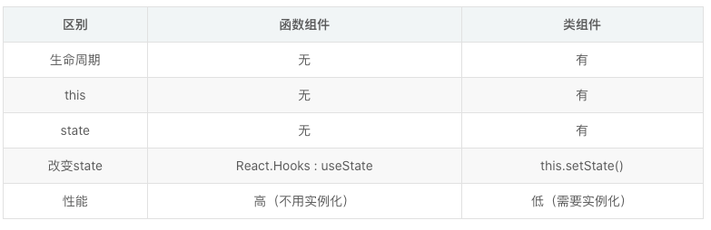

## 1. 谈谈对react 的理解？

1. React 本质上就是一个构建用户界面的 JavaScript 库，通过组件化的方式解决视图层开发复用的问题；
2. 组件化的优势在于视图的拆分与组件复用，可以更容易做到高内聚低耦合
3. 适用场景广：可以使用 React-dom 开发 PC 网页或者移动端网页；使用 React-Native，开发 iOS 与 Android 应用；还有 React-360 可以开发 VR 应用；

缺点：由于 React 并不是一个典型的框架，比如路由 这样的功能，React 团队更希望交给社区来解决。所以导致在技术选型与学习使用上有比较高的成本。但也正因为社区蓬勃发展，非官方的一揽子解决方案还是有的，比如  React Router 、组件库 Antd 、长列表 React-window 等填补了生态位的缺失。

## 2. 为什么 React 选择使用 JSX ？

+ 什么是JSX?  Facebook给JSX的定位是JavaScript的扩展（直接决定了浏览器并不会像天然JavaScript一样地支持JSX，需要通过babel转译），

+ 为什么 React 选择使用 JSX ？本质就是萝卜青菜各有所爱，React 团队认为 JSX 不会引入太多新的概念，编码更纯净，更具有可读性，更贴近 HTML，而对于 JSX 本身来说，是 `React.createElement()` 函数的语法糖，createElement() 对参数进行拆解后，发起 ReactElement 调用生成虚拟 DOM 对象； JSX语法糖允许前端开发者使用我们最熟悉的类HTML标签语法来创建虚拟DOM在降低学习成本的同时，也提升了研发效率与研发体验。

## 3. 类组件和函数组件有哪些相同点和不同点？

#### 相同点：

1. props不能改变
2. 父组件props有变化时，子组件随之而改变

####  不同点：

1. **函数式组件捕获了渲染所用的值** （https://overreacted.io/zh-hans/how-are-function-components-different-from-classes/）

   

## 4. React中跨组件通信有哪些方案？分别介绍原理和应用场景？

1. 父组件 => 子组件：
   + Props
2. 子组件 => 父组件
   + Callback
3. 兄弟组件之间
   + 共同的父组件
4. 不相关的组件
   + Context
   + Redux等

