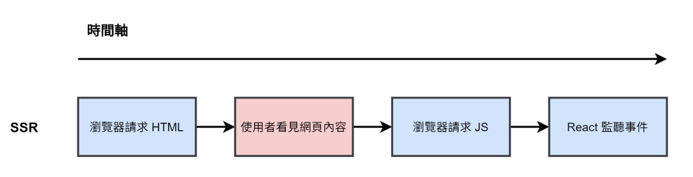
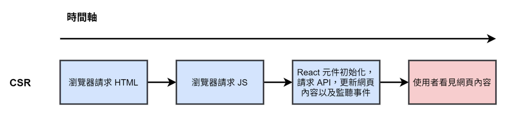
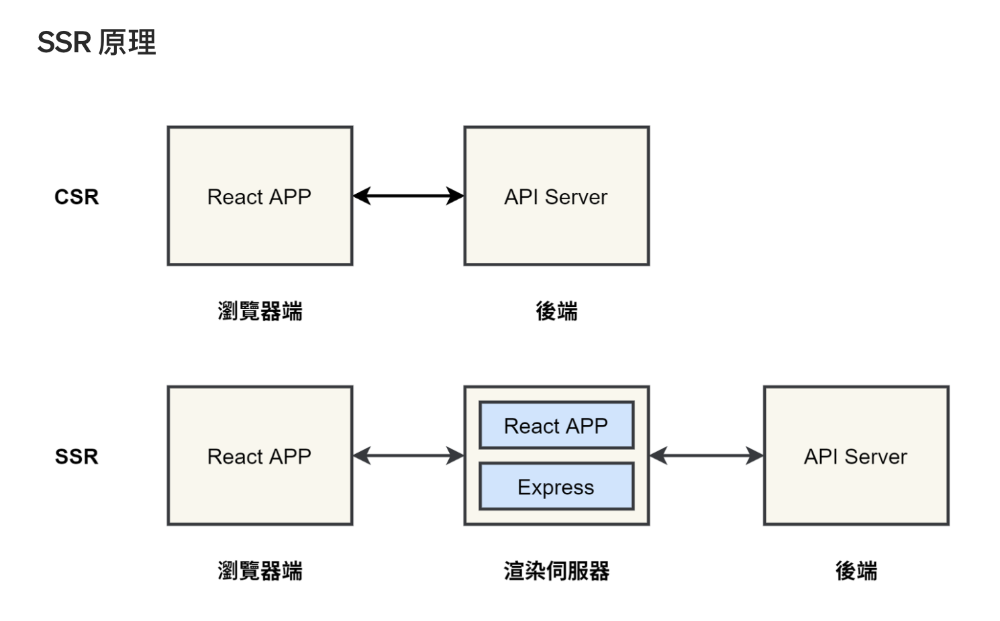
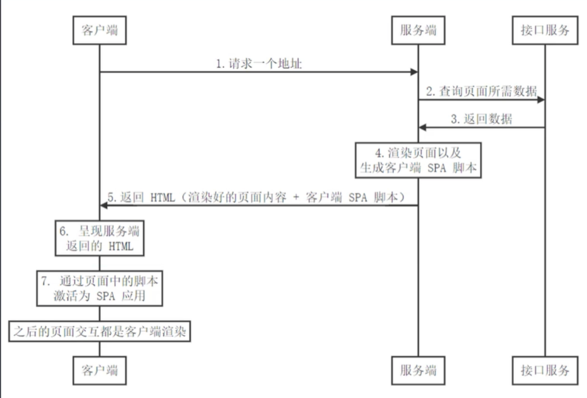

### 服务端渲染的好处：

- 首屏加载

- SEO 友好

### CSR VS. SSR




### SSR 原理



CSR 與 SSR 主要不一樣的點在於多了一個渲染伺服器，渲染伺服器會用於第一次使用者請求 HTML 時，會將內容都事先放到 HTML 中，所以使用者看到的就是一個已經包含完整內容的網頁。
以下包含 React SSR 幾個重點：

- 有一个独立的伺服器 (後端)，提供 API 可以請求資料。
- 渲染伺服器與和浏览器端都可以請求 API
- 渲染伺服器會在使用者請求 HTML 時，會請求 API 的資料，並將內容都事先放到 HTML 中。
- 在第一次請求 HTML 後，之後的元件 routing、請求 API 都是在浏览器端執行。



### React 如何实现渲染

- renderToString：将 React Component 转换为 HTML 字符串，生成的 DOM 会带有额外的属性：每个 DOM 会有`data-react-id`属性，第一个 DOM 会有`data-checksum`属性。

- renderToStatucMarkup：将 React Component 转换为 HTML 字符串，但不会有额外的属性。

### 同构的概念

```jsx
const HelloWorld = () => {
  return (
    <div>
      <h1>Hello World</h1>
      <button
        onClick={() => {
          alert("click");
        }}
      >
        click me
      </button>
    </div>
  );
};
```

虽然 button render 在了页面上，但是我们点击事 alert 没有触发。因为 renderToString 只渲染了组件的内容，而不会绑定事件，为了能够给页面上的组件绑定事件，**我们需要将 React 代码在服务端执行一遍，在客户端再执行一遍，这种服务器端和客户端共用一套代码的方式就称之为同构。**及客户端和服务端使用相同的组件，服务端负责首次渲染，行为和交互由客户端进行。

4. 如何做同构？

   - client 端我们使用 React16 新提出的**hydrate**来完成这项任务，此方法由`react-dom`提供。他能代替之前的`render`方法，复用服务端传来内容，并绑定好事件。即该函数将接收已由服务端渲染的 React app， 并将附加事件处理程序。

   - 添加 webpack 的 client 端配置，打包生成 js 文件，将 js 的文件通过 script 放入 html 中

## 路由同构

React 中，一般客户端渲染时使用**BrowserRouter**，而服务端渲染，我们需要使用`react-router-dom`提供的无状态的**StaticRouter**。BrowserRouter 会根据 url 来保持页面同步，而 StaticRouter 只会传入服务器提供的 url，以便路由匹配

### 数据同构

添加redux 后，如果直接在组件中发请求的话，数据只在浏览器端render， SEO 不友好。為了解決這個問題 Next.js 提供了 `getInitialProps` 函式，讓開發人員可以在每個元件下定義 `getInitialProps` 函式，**這個函式的主要功能就是讓 SSR 能夠事先載入資料**，搜尋引擎看到的就是有資料的 HTML，有利于 SEO。

可以使用`react-router-config`. 原因是在使用者請求一個網頁的 HTML 時，透過 `react-routet-config` 提供的 `matchRoutes()` 知道哪幾個元件要被顯示在 HTML 中，然後呼叫在元件上定義的 `getInitialData()` 取得事先載入的資料，然後儲存到 redux store。


### 数据的注水和脱水


+ 什么是脱水？

  在服务器端，当服务端请求接口拿到数据，并处理好数据状态(例如 `store`的更新)后，保留住这个状态，在服务器端响应页面`HTML`的时候，将这个状态一并传递给浏览器，这个过程，叫做**脱水**(`Dehydrate`)；

+ 什么是注水？

  在浏览器端，就直接拿这个**脱水**数据来初始化 `React`组件，也就是客户端不需要自己发起请求获取数据处理状态了，因为服务器端已经做好了这件事情，直接从服务器端那里获取处理好的状态即可，这个过程叫**注水**

将生命周期钩子里面的异步请求函数注释，现在页面中不会有任何的数据，但是打开网页源代码，却发现服务端存在数据。那这就说明服务端和客户端的store不同步的问题。

原因：当服务端拿到store并获取数据后，客户端的js代码又执行一遍，在客户端代码执行的时候又创建了一个空的store，两个store的数据不能同步。

如何解决：

```js
<script>
  window.context = {
    state: ${JSON.stringify(store.getState())}
  }
</script>
```


这叫做数据的“注水”操作，即把服务端的store数据注入到window全局环境中。 接下来是“脱水”处理，换句话说也就是把window上绑定的数据给到客户端的store，可以在客户端store产生的源头进行，即在全局的store/index.js中进行。


### css 样式处理

一般我们处理 css 样式，需要使用的插件是`style-loader`，但是此插件在服务端的 node 环境是无法愉快玩耍的。我们需要使用一个专门为服务端渲染而生的插件，即**isomorphic-style-loader**，

具体的参见: https://juejin.cn/post/6844903822884601864#heading-8

### 问题：

1. ReactDOM.render 和 ReactDOM.hydrate 的区别?

   React 15 中，无 hydrate，在浏览器端渲染之后，会把内容和服务器端给的 HTML 做一个比对。如果完全一样，那最好，接着用服务器端 HTML 就好了；如果有一丁点不一样，就会立刻丢掉服务器端的 HTML，重新渲染浏览器端产生的内容，结果就是用户可以看到界面闪烁。因为 React 抛弃的是整个服务器端渲染内容，组件树越大，这个闪烁效果越明显。

   在 react15 中，当服务端和客户端渲染不一致时，render 会做 dom patch，使得最后的渲染内容和客户端一致。render 遵从客户端渲染虽然保证了客户端代码的一致性，但是其需要对整个应用做 dom diff 和 dom patch，其花销仍然不小。在 React16 中，为了减小开销，和区分 render 的各种场景，其引入了新的 api，hydrate。hydrate 的策略与 render 的策略不一样，其并不会对整个 dom 树做 dom patch，其只会对 text Content 内容做 patch，对于属性并不会做 patch。

   React 在 v16 之后使用 render 不再要求整个组件树两端渲染结果分毫不差，但是如果发生不一致，依然会抛弃局部服务器端渲染结果。

   总之，**如果用服务器端渲染，一定要让服务器端塞给 React 组件的数据和浏览器端一致**。

   ，**React 預期在伺服器端與客戶端所渲染的內容是相同的**，如果不相同，hydrate 會修復不同的部分，但同時會跳出 Warning，警告 hydrate 前後的 DOM 長得不一樣。不一樣時，hydrate 不保證會修復 attribute，而且會降低 React 的效能。

2. **BrowserRouter** 和 **StaticRouter** 的作用？

   BrowerRouter 使用 HTML5 提供的 history API (pushState, replaceState 和 popstate 事件) 来保持 UI 和 URL 的同步。

   StaticRouter 从不改变位置的 router.表明在 StaticRouter 中，並不會因 为 path 改變，导致渲染不同的元件，位置从一开始就是固定的。所以使用**StaticRouter** 需要传入`location`
   这在服务器端呈现场景中非常有用，因为用户实际上并没有点击，所以位置实际上不会改变。

```
const content = renderToString(
  <BrowserRouter>
    <Routes />
  </BrowserRouter>
);
```

主要是**因為 BrowserRouter 使用的是 History API 紀錄位置**，而 History API 是屬於瀏覽器的 API，在 SSR 的環境下，伺服器端沒有瀏覽器 API 可以使用，所以最終會跳出錯誤訊息。


文档：

1. https://zhuanlan.zhihu.com/p/76967335
2. 基础篇：https://medium.com/%E6%89%8B%E5%AF%AB%E7%AD%86%E8%A8%98/server-side-rendering-ssr-in-reactjs-part1-d2a11890abfc
3. SSR- redux: https://medium.com/%E6%89%8B%E5%AF%AB%E7%AD%86%E8%A8%98/server-side-rendering-ssr-in-reactjs-part3-7f2097963754
4. 服务端load 数据：https://medium.com/%E6%89%8B%E5%AF%AB%E7%AD%86%E8%A8%98/server-side-rendering-ssr-in-reactjs-part4-38649606d384

