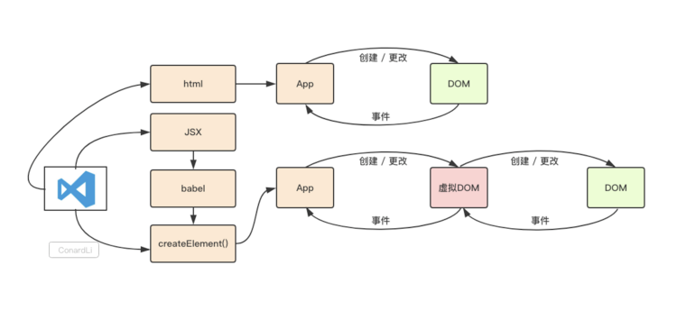

## 1. 什么是Virtual DOM

Virtual DOM是对DOM的抽象,本质上是JavaScript对象,这个对象就是更加轻量级的对DOM的描述.

## 2. 为什么需要Virtual DOM？

1. 为了性能的优化。前端性能优化的一个点就是尽可能少地操作DOM,真实的DOM 更新比较慢，频繁的变动DOM会造成浏览器的回流或者重回。因此我们需要这一层抽象,在patch过程中尽可能地一次性将差异更新到DOM中,这样保证了DOM不会出现性能很差的情况.

2. 提高开发的效率。前端框架的一个基本要求就是无须手动操作DOM,一方面是因为手动操作DOM无法保证程序性能,多人协作的项目中如果review不严格,可能会有开发者写出性能较低的代码,另一方面更重要的是省略手动DOM操作可以大大提高开发效率.

3. 跨平台。比如Node.js就没有DOM,如果想实现SSR(服务端渲染),那么一个方式就是借助Virtual DOM,因为Virtual DOM本身是JavaScript对象.

## 3. 虚拟DOM 的实现原理？

#### React组件的渲染流程

+ 使用`React.createElement`或`JSX`编写`React`组件，实际上所有的`JSX `代码最后都会转换成`React.createElement(...) `，`Babel`帮
  助转换。

+ `createElement()`函数对`key`和`ref`等特殊的`props`进行处理，并获取`defaultProps`对默认`props`进行赋值，并且对传入的孩子节点进行处理，最终构造成一个`ReactElement`对象（所谓的虚拟`DOM`）

+ `ReactDOM.render`(vdom, container) 将生成好的虚拟`DOM`渲染到指定容器上，其中采用了批处理、事务等机制并且对特定浏览器进行了性能优化，最终转换为真实`DOM`。

  简单来说：

  虚拟DOM本质上是JavaScript对象,是对真实DOM的抽象， 状态变更时，记录新树和旧树的差异， 最后把差异更新到真正的dom中

####  VDOM组成

即`ReactElement`element对象，我们的组件最终会被渲染成下面的结构：

- `type`：元素的类型，可以是原生html类型（字符串），或者自定义组件（函数或`class`）

- `key`：组件的唯一标识，用于`Diff`算法，下面会详细介绍

- `ref`：用于访问原生`dom`节点

- `props`：传入组件的`props`，`chidren`是`props`中的一个属性，它存储了当前组件的孩子节点，可以是数组（多个孩子节点）或对象（只有一个孩子节点）

- `owner`：当前正在构建的`Component`所属的`Component`

- `self`：（非生产环境）指定当前位于哪个组件实例

- `_source`：（非生产环境）指定调试代码来自的文件(`fileName`)和代码行数(`lineNumber`)

  

  虚拟 DOM 对象最基本的三个属性：

  - 标签类型 type
  - 标签元素的属性 props
  - 标签元素的子节点，以数组的形式  children

#### 虚拟DOM事件机制

