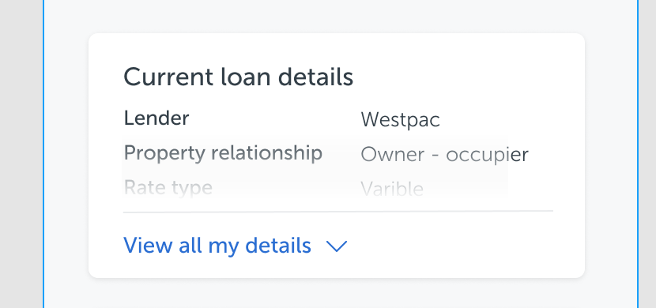

问题：如何实现Rate type的阴影遮罩效果?




```css
<div class="box">
   ...
   <div>Rate Type</div>
   <div class="mask"/>
   <div class="footer">View all my details</div>
</div>

.box{
  position: relative;
}

.mask{
  position: absolute;
  bottom: 45px;
  width: 100%;
  height: 45px;
  background: linear-gradient(
    180deg,
    rgba(238, 238, 238, 0.0001) 0%,
    #ffffff 100%
  );
}
```

踩坑：开始尝试用footer 加box-shadow 来解决，没有成功，box-shadow 的白色没有办法覆盖住字体的黑色

### 一、position 的四个值：static、relative、absolute、fixed。

绝对定位：absolute 和 fixed 统称为绝对定位（脱离文档流）

相对定位：relative （不脱离文档流）

默认值：static

### 二、relative定位与absolute定位的区别

1. **relative：相对于原来位置移动，元素设置此属性之后仍然处在文档流中，不影响其他元素的布局**

   给**relative** 加的top 和bottom 是相对于原来位置的移动

2. **absolute:元素会脱离文档流，如果设置偏移量，会影响其他元素的位置定位**
   + **在父元素没有设置相对定位或绝对定位的情况下，元素相对于根元素定位（即html元素）（是父元素没有）。**
   + **父元素设置了相对定位或绝对定位，元素会相对于离自己最近的设置了相对或绝对定位的父元素进行定位（或者说离自己最近的不是static的父元素进行定位，因为元素默认是static）。**


### 三、absolute如何确定定位点

1. 用户只给元素指定了absolute，未指定left/top/right/bottom。此时absolute元素的左上角定位点位置就是该元素正常文档流里的位置。
2. 用户给absolute元素指定了left/right，top/bottom，由于没有position:static以外的父元素，此时absolute元素可以去任意它想去的地方，天空才是它的极限，相对body定位。
3. relative主要用于限制absolute，用relative可以有效限制子absolute元素的拉伸平铺范围

### 四. fixed 定位和absolute定位的区别

1.  共同点：都会脱离当前文档流，触发BFC

2. 相对定位的元素不同：absolute是相对于离它最近的有定位的父元素进行定位（如果没有定位的父元素则相对于浏览器窗口）；fixed是相对于浏览器窗口定位, 相对于根元素，不受父元素的影响
3. 在没有滚动条的情况下两者其实没有差异。但是在有滚动条后，fixed始终会在定好的位置不动，而absolute会随参照对象元素的宽高变化为移动。

3. 一般fixed用在遮盖层和固定在页面某个位置（固定在顶端的菜单栏 / 弹出框居中显示 / 页面两侧的广告位等）。


### 五.  position: sticky

`position: sticky` 可以看出是`position:relative`和`position:fixed`的结合体.

粘性定位是相对定位和固定定位的混合。元素在跨越特定阈值前为相对定位，之后为固定定位。

Sticky 不会脱离文档流


