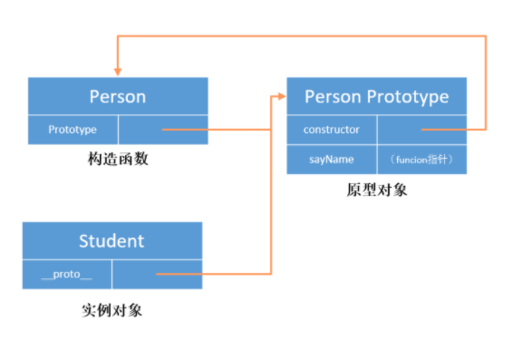
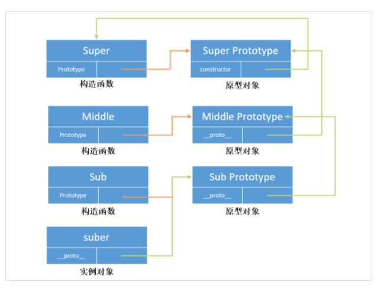

https://juejin.im/post/6844904093828251662


#### 2. 每个实例的方法是共享的吗？

1. ##### 在构造函数上直接定义方法（不共享）

2. 构造函数通过原型分配的函数，是所有对象共享的


## 原型和原型链

原型：分为函数的原型和对象的原型

函数的原型: ```Person.prototype```

对象的原型：```person.__proto__``


当我们调用构造函数创建一个新实例后，在这个实例的内部将包含一个指针，指向构造函数的原型对象.在 ECMA-262 第五版中管这个指针叫做 [[Prototype]] 

需要注意的是在脚本中没有标准的方式访问 [[Prototype]] 属性，但是在 Firefox，Safari 和 Chrome 中每个对象中都支持一个属性 __proto__ 来访问，为了区分 prototype 属性，我们在下边都使用 __proto__来表示。

```
var student = new Person();

console.log(student.__proto__ === Person.prototype); // true
```



问题： new一个新对象的过程，发生了什么？

(1) 创建一个空对象 student  `{}`
 (2) 为 student 准备原型链连接 `student.__proto__ = Person.prototype`
 (3) 重新绑定this，使构造函数的this指向新对象 `Person.call(this)`
 (4) 为新对象属性赋值 `student.name`
 (5) 返回this `return this`，此时的新对象就拥有了构造函数的方法和属性了

每次生成实例，都是新开辟一个内存空间存方法。这样会导致内存的极大浪费，从而影响性能。


方法：

虽然我们在脚本中没有办法访问到[[Prototype]]属性，但是我们可以通过 isPrototypeOf 方法来确定对象之间是否存在这种关系。

isPrototypeOf() 方法用于测试一个对象是否存在于另一个对象的原型链上。

```js
console.log(Person.prototype.isPrototypeOf(student)); // true
```

在es 5 中新增了一个方法叫 Object.getPrototypeOf() ，这个方法可以返回[[Prototype]]的值，如下

```js
console.log(Object.getPrototypeOf(student) === Person.prototype); // true
```


#### 原型的属性

1. 属性的访问：

   每当代码读取对象的某个属性时，首先会在对象本身搜索这个属性，如果找到该属性就返回该属性的值，如果没有找到，则继续搜索该对象对应的原型对象，以此类推下去。

   ```js
   function Person(name) {
     this.name = name;
   }
   Person.prototype.sayHi = function() {
     alert('Hi, I am ' + this.name);
   }
   
   var fred = new Person('Fred'); // 设置 `fred.__proto__` 为 `Person.prototype`
   ```

   那个 `__proto__` 链才是 JavaScript 用来查找属性的：

   ```js
   fred.sayHi();
   // 1. fred 有 sayHi 属性吗？不。
   // 2. fred.__proto__ 有 sayHi 属性吗？是的，调用它！
   
   fred.toString();
   // 1. fred 有 toString 属性吗？不。
   // 2. fred.__proto__ 有 toString 属性吗？不。
   // 3. fred.__proto__.__proto__ 有 toString 属性吗？是的，调用它！
   ```

   在实战中，你应该几乎永远不需要直接在代码里动到 `__proto__` ，除非你在调试和原型链相关的问题。如果你想让某样东西在 `fred.__proto__` 上可用，你应该把它放在 `Person.prototype`，至少它最初是这么设计的。

   

2. 属性的判断

   既然一个属性既可能是实例本身的，也有可能是其原型对象的，那么我们该如何来判断呢？

   + hasOwnProperty（）: 这个方法只有在给定属性存在于实例中时，才会返回 true 。[已知属性一定存在]

```
function Person() {};

Person.prototype.name = "laker" ;

var student = new Person();

console.log(student.name); // laker
console.log(student.hasOwnProperty("name")); // false


student.name = "xiaoming";
console.log(student.name); //xiaoming 屏蔽了原型对象中的 name 属性
console.log(student.hasOwnProperty("name")); // true
```

+ 当不确定属性不存在时，可以使用in,它会在对象能够访问给定属性时返回 true，无论该属性存在于实例还是原型中。

  ```
  function hasPrototypeProperty(object, name){
      return !object.hasOwnProperty(name) && (name in object);
  }
  ```

  

  #### 原型链

  并将原型链作为实现继承的主要方法。其基本思想是利用的一个引用类型继承另一个引用类型的属性和方法。

  

  原型链的主要实现方法是让构造函数的 prototype 对象等于另一个类型的实例，此时的 prototype 对象因为是实例，因此将包含一个指向另一个原型的指针，相应地另一个原型中也包含着一个指向另一个构造函数的指针。假如另一个原型又是另一个类型的实例，那么上述关系依然成立，如此层层递进，就构成了实例与类型的链条。这就是原型链的基本概念。

demo：

```
function Super(){

};


function Middle(){

};

function Sub(){

};

Middle.prototype = new Super();

Sub.prototype = new Middle();

var suber = new Sub();
```



注意：Object.prototype 就是原型链的终点了，我们可以试着打印一下 `Object.prototype.__proto__`，我们会发现返回的是一个 null 空对象，这就意味着原型链的结束。


#  DOM, DOCUMENT, BOM, WINDOW 有什么区别?

1. DOM 全称是 Document Object Model，也就是文档对象模型。DOM 就是针对 HTML 和 XML 提供的一个API。**为了能以编程的方法操作这个 HTML 的内容**（比如添加某些元素、修改元素的内容、删除某些元素），我们把这个 HTML 看做一个对象树（DOM树），它本身和里面的所有东西比如 <div></div> 这些标签都看做一个对象，每个对象都叫做一个节点（node），节点可以理解为 DOM 中所有 Object 的父类。

   DOM 节点包括元素节点，文本节点，属性节点

2. **document**

当浏览器下载到一个网页，通常是 HTML，这个 HTML 就叫 document（当然，这也是 DOM 树中的一个 node），从上图可以看到，document 通常是整个 DOM 树的根节点。

在一个浏览器窗口中可能有多个 document，例如，通过 iframe 加载的页面，每一个都是一个 document。

3. BOM 是 Browser Object Model，浏览器对象模型。为了控制浏览器的行为**而出现的接口。**

4. Window 对象表示浏览器中打开的窗口。

   > 总结： DOM 是为了操作文档出现的 API，document 是其的一个对象；
   > **BOM 是为了操作浏览器出现的 API，window 是其的一个对象。**


##  JS 运行机制

1. 首先js 是单线程运行的，在代码执行的时候，通过将不同函数的执行上下文压入执行栈中来保证代码的有序执行。

2. 在执行同步代码的时候，如果遇到了异步事件，js 引擎并不会一直等待其返回结果，而是会将这个事件挂起，继续执行执行栈中的其他任务

3. 当同步事件执行完毕后，再将异步事件对应的回调加入到与当前执行栈中不同的另一个任务队列中等待执行。

4. 任务队列可以分为宏任务对列和微任务对列，当前执行栈中的事件执行完毕后，js 引擎首先会判断微任务对列中是否有任务可以执行，如果有就将微任务队首的事件压入栈中执行。

5. 当微任务对列中的任务都执行完成后再去判断宏任务对列中的任务。

