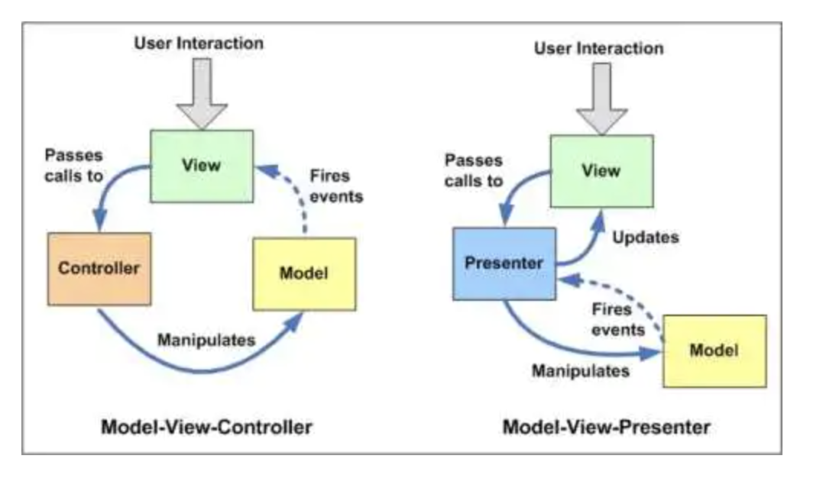

## 什么是 MVC？

MVC 允许在不改变视图的情况下改变视图对用户输入的响应方式，用户对 View 的操作交给了 Controller 处理，在 Controller 中响应 View 的事件调用 Model 的接口对数据进行操作，一旦 Model 发生变化便通知相关视图进行更新。

1. View 传送指令到 Controller
2. Controller 完成业务逻辑后改变 Model 状态
3. Model 将新的数据发送至 View,用户得到反馈

用户访问 view，触发事件点击，交由 controller 来处理，controller 处理完成后更新数据 model，model 将最新的数据交给 view 渲染。

## 什么是 MVP？

MVP 是把 MVC 中的 Controller 换成了 Presenter（呈现），目的就是为了完全切断 View 跟 Model 之间的联系，由 Presenter 充当桥梁，做到 View-Model 之间通信的完全隔离。

触发 View 中的 click 事件，click 通知 Presenter 操作对应的业务数据，操作完成后 Presenter 更新 Model 数据，最后 Presenter 调用 View 的 show 接口渲染页面。

> Model 没变化，还是负责维护数据。
> View 中取消了与 model 的关联关系，并且将特定渲染目的暴露出接口。
> Presenter 中负责处理业务数据，更新数据库，以及调用 view 的渲染接口更新页面数

## 什么是 MVVM？

[MVVM](https://en.wikipedia.org/wiki/Model–view–viewmodel)是 Model-View-ViewModel 的缩写，是一种架构模式

它是将“数据模型数据双向绑定”的思想作为核心，因此在 View 和 Model 之间没有联系，通过 ViewModel 进行交互，而且 Model 和 ViewModel 之间的交互是双向的，因此视图的数据的变化会同时修改数据源，而数据源数据的变化也会立即反应到 View 上。

MVC,MVP,MVVM 是三种常见的前端架构模式(Architectural Pattern),它通过分离关注点来改进代码组织方式。

## MVVM 和 MVC 的区别是什么？

MVVM 与 MVC 最大的区别就是：它实现了 View 和 Model 的自动同步，也就是当 Model 的属性改变时，我们不用再自己手动操作 Dom 元素，来改变 View 的显示，而是改变属性后该属性对应 View 层显示会自动改变。

MVVM 模式的代表，Vue

看图说话：
图中对比的是 MVC 和 MVP，但是 MVP 和 MVVM 的区别基本就是 MVVM 把三者间的操作自动绑定了，不用开发者操心 V 和 P 之间的相互操作。
MVC 是由 M 通知 V，但 MVVM 是 M 通知 VM（M 和 V 没有直接关系）。

相较于 MVP 提供的解决方案，MVVM 的解决方案比较复杂，会利用到数据绑定（Binding），路由事件（Routed Events），命令（Command），依赖属性（Dependency Property）来减轻各层之间的耦合。

在 MVVM 模式下，ViewModel 中会存在一个叫 Binder，或者是 Data-binding engine 的东西。
Binder 的主要作用是替代之前 Controller 和 Presenter 中 view 与 model 的操作。实现 view 发生变化时 model 自动更新，model 变化时 view 自动更新。这种方式称为：Two-way data-binding，双向数据绑定。

### 参考文档

1. http://www.isjs.cn/?p=1037
