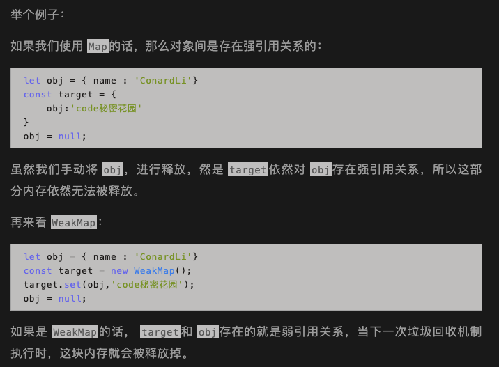
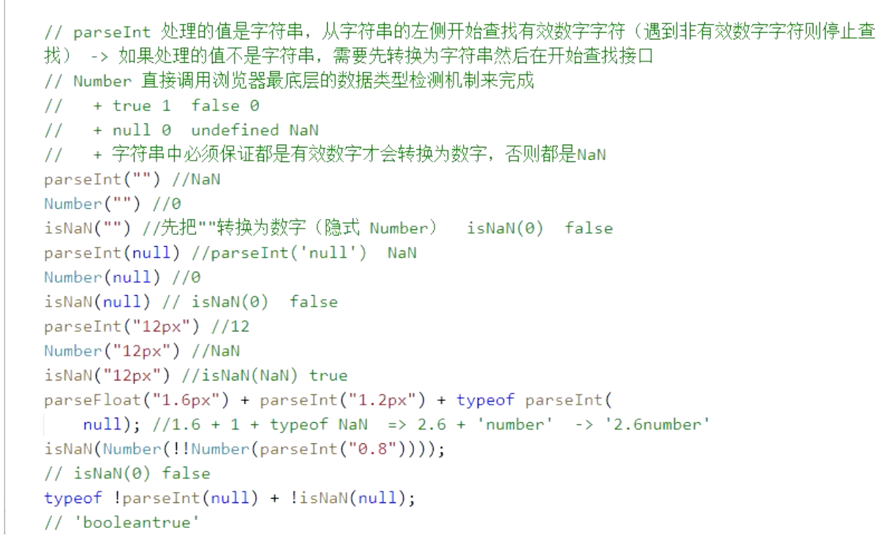
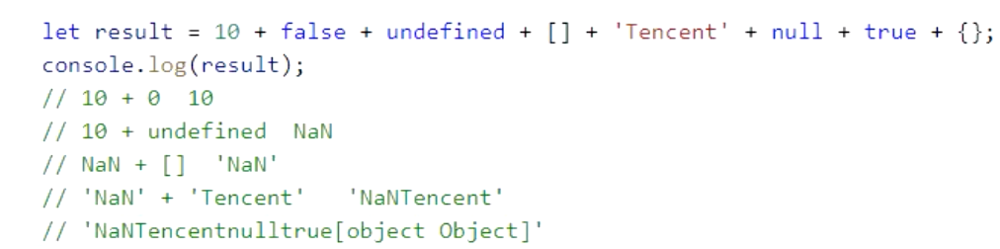
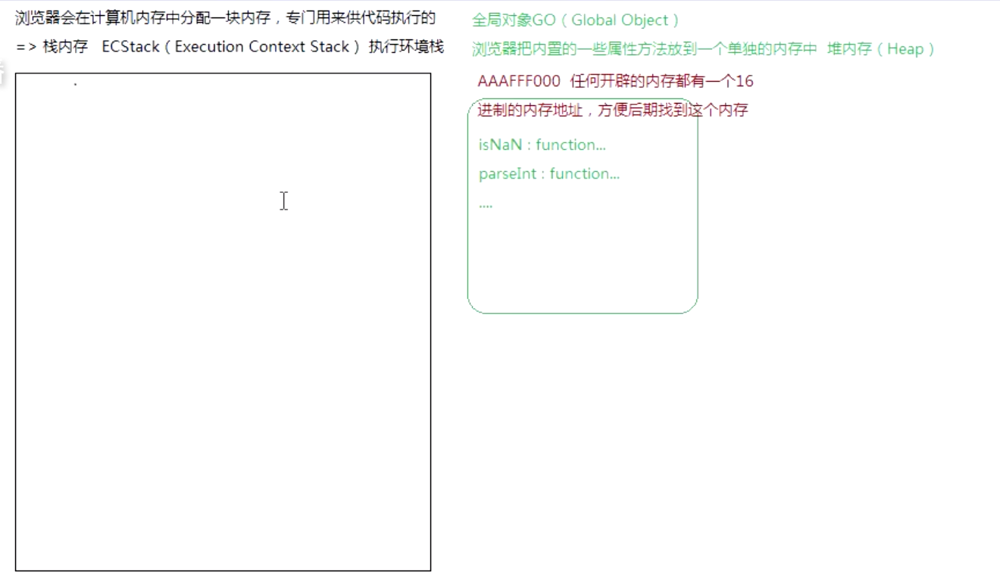
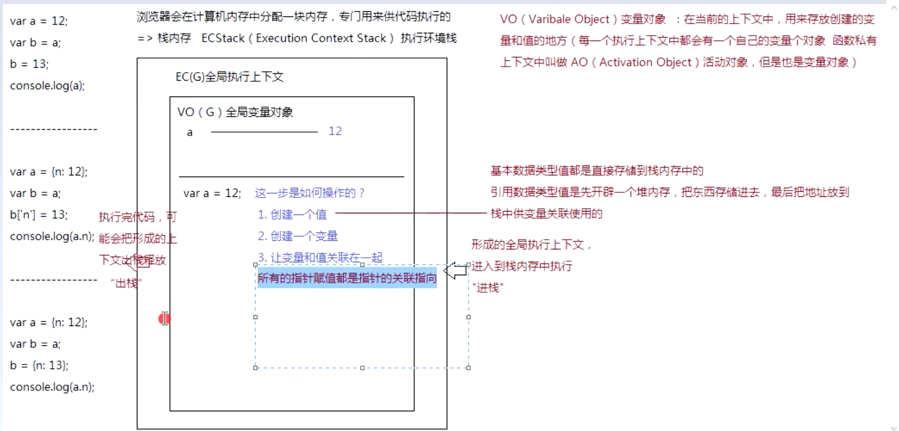
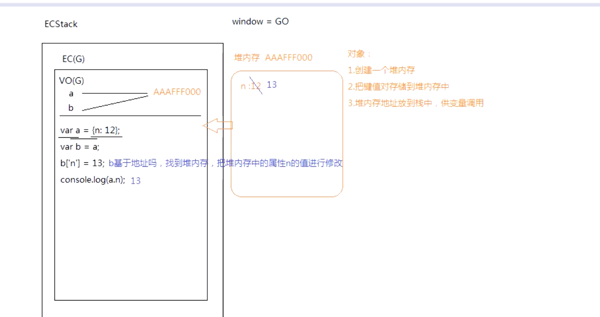
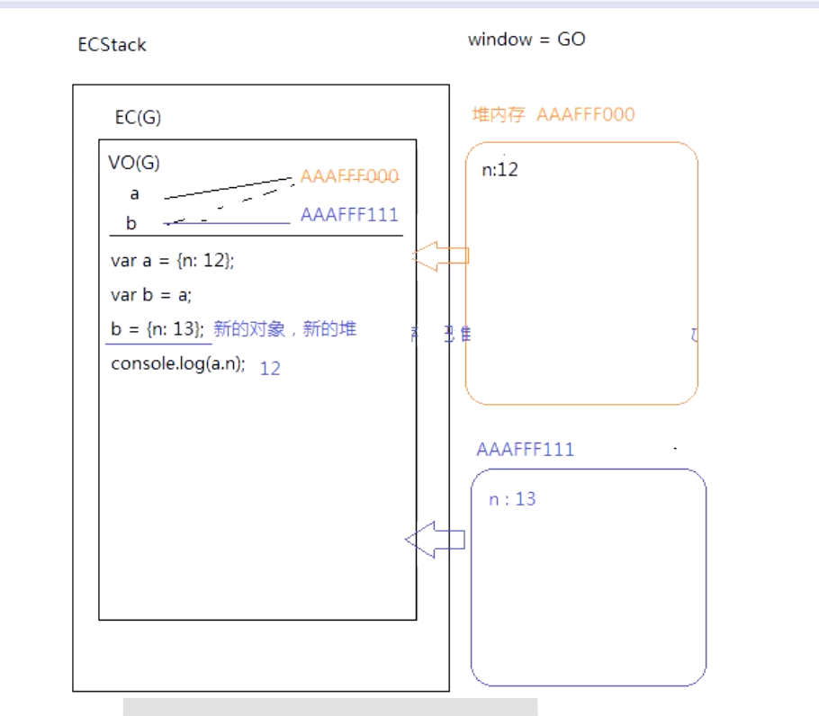
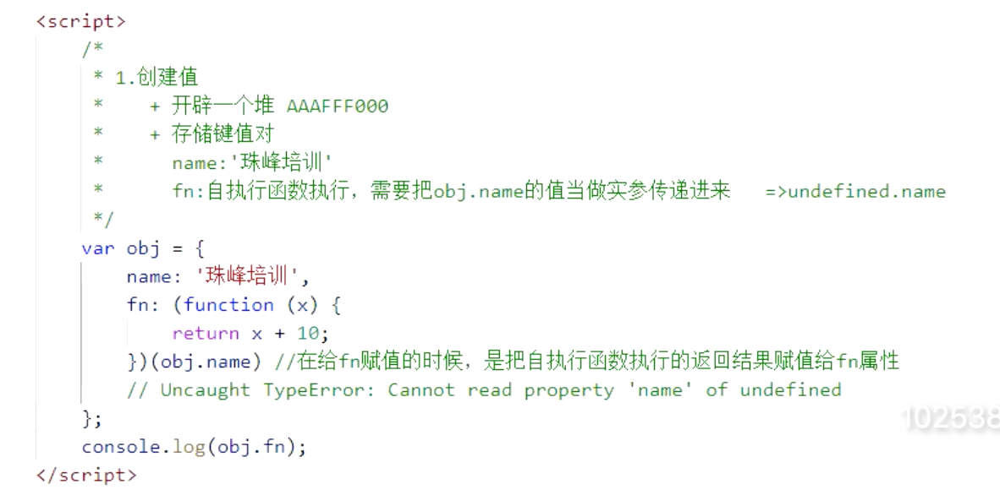
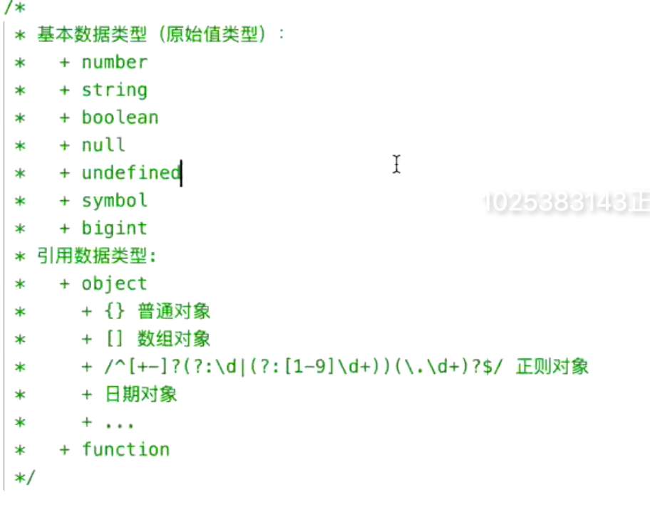

## Js 的数据类型

### 1.基本类型（7个）：

+ Number
  + NaN 属于Number 类型 ，NaN 不是一个有效数字， NaN 不等于NaN，和自己本身也不相等，用isNaN（）方法用于检测是否是NaN
  + Infinity属于Number 类型 ，无穷大的值
  + ParseFloat('Left: 20') => NaN , parseFloat 从第一个开始找，如果是数字，转化为数字，第一个不是数字，结束查找转化

+ string
+ Boolean
+ null
+ Undfiend
+ symbol
+ bigint

### 2. 引用数据类型（2个）

+ object

  + 数组对象
  + 普通对象
  + 正则
  + 日期
  + Math
  + Set
  + weakSet
  + Map
  + weakMap   (ES6新增的数据类型（Set，Map，weakSet，weakMap）都属于Object)
+ Function
+ 

### Map 和weakMap 的区别

1. WeakMap对key的引用是弱引用

   什么是弱应用？

   弱引用与强引用相对，是指不能确保其引用的对象不会被垃圾回收器回收的引用。一个对象若只被弱引用所引用，则被认为是不可访问（或弱可访问）的，并因此可能在任何时刻被回收。

   `const obj={}`，就默认创建了一个强引用的对象，我们只有手动将 `obj=null`，它才会被垃圾回收机制进行回收，如果是弱引用对象，垃圾回收机制会自动帮我们回收。

   

2. WeakMap的key只能是对象

### 数据类型检测

+ typeof 检测数据类型的逻辑运算符

  + js 局限性: typeof null 为object, 但null 是基本类型

  + 返回的结果都是字符串

    Eg: typeof typeof typeof [12,23]  => "string",  因为：typeof [12,23] => "object", typeof "object"=>"string" typeof "string"=>"string"

+ Intanceof 检测是否为某各类的实例
+ Constructor 检测构造函数
+ Obejct.prototype.toString.call 检测数据类型

### 将其它类型转化为数字

+ 强转化 （基于底层机制转换的）Number(value)
+ 弱转化 （基于一些额外的方法转换）parseInt(value)/paeseFloat(value)

浏览器端 window 指向的就是全局对象

栈内存：提供代码执行的环境

堆内存：存放东西（存放的是属性方法）

