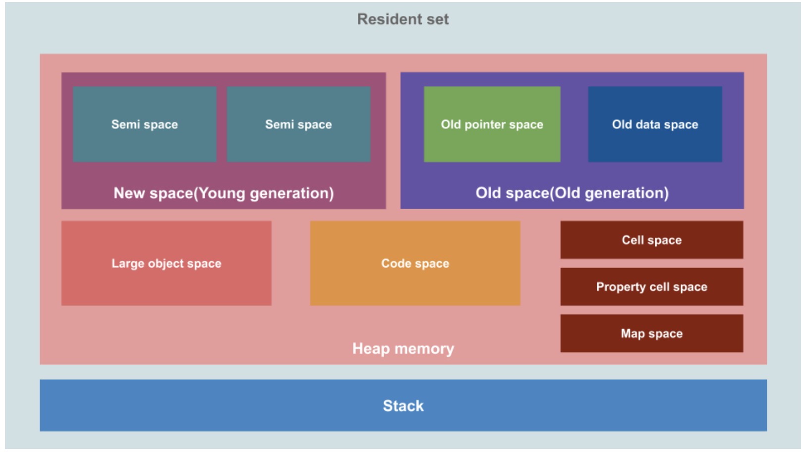
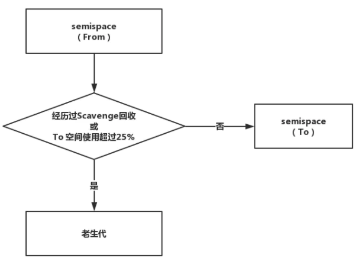
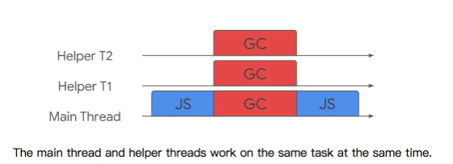
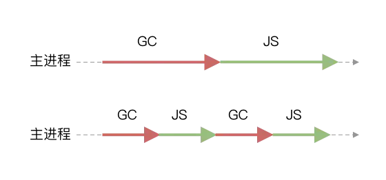
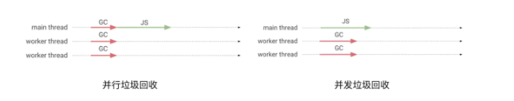

# 垃圾回收机制

### 垃圾回收 Garbage Collection

JavaScript 中的内存管理是自动执行的，而且是不可见的。JavaScript 引擎中有一个后台进程称为[垃圾回收器](https://en.wikipedia.org/wiki/Garbage_collection_(computer_science))，它监视所有对象，并删除那些不可访问的对象，并释放内存空间。

一般来说没有被引用的对象就是垃圾，就是要被清除， 有个例外如果几个对象引用形成一个环，互相引用，但根访问不到它们，这几个对象也是垃圾，也要被清除。

### 如何做垃圾回收？

1. 引用的概念

   垃圾回收算法主要依赖于引用的概念。在内存管理的环境中，一个对象如果有访问另一个对象的权限（隐式或者显式），叫做一个对象引用另一个对象。在这里，“对象”的概念不仅特指 JavaScript 对象，还包括函数作用域（或者全局词法作用域）。

   ###  

2. 垃圾回收算法

   #### 引用计数

   这种方式常常会引起内存泄漏，低版本的IE使用这种方式。

   这是最初级的垃圾收集算法。此算法把“对象是否不再需要”简化定义为“对象有没有其他对象引用到它”。如果没有引用指向该对象（零引用），对象将被垃圾回收机制回收。简单地说，如果该对象每被引用一次，则+1，每被释放几次，则-1。当引用次数变成0时，说明没办法访问这个值了。当垃圾收集器下一次运行时，它就会释放引用次数是0的值所占的内存。

   

   ```js
   // 创建一个对象，由变量o指向这个对象的两个属性
   var o = {
       name: '听风是风',
       handsome: true
   };
   // name虽然设置为了null，但o依旧有name属性的引用
   o.name = null;
   var s = o;
   // 我们修改并释放了o对于对象的引用，但变量s依旧存在引用
   o = null;
   // 变量s也不再引用，对象很快会被垃圾回收器释放
   s = null;
   
   ```

   问题：

   引用计数存在一个很大的问题，就是对象间的循环引用，比如如下代码中，对象o1与o2相互引用，即便函数执行完毕，它们被调用之后会离开函数作用域，所以它们已经没有用了，可以被回收了。然而，引用计数算法考虑到它们互相都有至少一次引用，所以它们不会被回收。

   ```js
   function f() {
       var o1 = {};
       var o2 = {};
       o1.a = o2; // o1 引用 o2
       o2.a = o1; // o2 引用 o1
       return;
   };
   f();
   ```

   


#### **标记清除** Mark-Sweep GC

从2012年起，所有现代浏览器都使用了标记-清除垃圾回收算法。

标记-清除算法分为两个阶段，即标记阶段和清除阶段。标记存活的对象，未被标记的则被释放。 首先会遍历堆中的所有对象，标记存活对象，清除非存活对象。进行空间的回收。

**工作原理**：是当变量进入环境时，将这个变量标记为“进入环境”。当变量离开环境时，则将其标记为“离开环境”。标记“离开环境”的就回收内存。

**工作流程**：

1. 垃圾回收器获取根并**“标记”**(记住)它们。
2. 然后它访问并“标记”所有来自它们的引用。
3. 然后它访问标记的对象并标记它们的引用。所有被访问的对象都被记住，以便以后不再访问同一个对象两次。
4. 以此类推，直到有未访问的引用(可以从根访问)为止
5. 除标记的对象外，所有对象都被删除。

#### 缺点

+ 碎片化， 会导致无数小分块散落在堆的各处
+ 分配速度不理想，每次分配都需要遍历空闲列表找到足够大的分块

####  V8 引擎的垃圾回收机制

v8 的内存结构：


堆内存由两部分组成：

1. **新生代内存(new space)：** 对象的存活时间较短。新生代内存区会被划分为两个semispace, 而这两个semispace分别是from space 和 to space

2. 老生代内存(old space):通常会较为持久的保存对象,也分为两个区域 **old pointer space** 和 **old data space**分别用来存放GC后还存活的指针信息和数据信息。
3. 大对象区（large object space）
   这里存放体积超越其他区大小的对象，主要为了避免大对象的拷贝，使用该空间专门存储大对象。
4. 单元区、属性单元区、Map区（Cell space、property cell space、map space）
    Map空间存放对象的Map信息也就是[隐藏类(Hiden Class）](https://time.geekbang.org/column/article/226417)最大限制为8MB；每个Map对象固定大小，为了快速定位，所以将该空间单独出来。
5. 代码区 (code Space)
   主要存放代码对象，最大限制为512MB，也是唯一拥有执行权限的内存

##### 垃圾回收算法在执行前，需要将应用逻辑暂停，执行完垃圾回收后再执行应用逻辑，这种行为称为 「全停顿」

### Scavenge 算法

新生代中的对象主要通过 Scavenge 算法进行垃圾回收。Scavenge 的具体实现，主要采用了Cheney算法。

Cheney算法采用复制的方式进行垃圾回收。它将堆内存一分为二，每一部分空间称为 semispace。这两个空间，只有一个空间处于使用中，另一个则处于闲置。使用中的 semispace 称为 「From 空间」，闲置的 semispace 称为 「To 空间」。

过程：比如我们新创建一个对象：

- 会向内存堆中的新生代去分配，假如此时新生代中的**from spcae** 是工作状态，那么对象会分配到**from space** 中。
- 经过一段时间程序运行，**from space**的的内存即将达到存储的上限。
- V8引擎此时执行一次垃圾清理操作，会将**from space**中不再使用的对象（根节点无法遍历到的对象）进行标记。
- 会将未被标记的对象进行复制，复制到空闲状态的**to space**中并且有序的重新排列起来，再将**from space**进行清空操作，同时将**from space** 标记为空闲状态将**to space**标记为工作状态。

以上就是所谓的置换也可以说是翻转过程，因为这种复制操作需要时间成本，所以新生代的空间往往并不大，所以执行的也较为频繁。

随着程序的运行，某些对象一直在被使用会持续的积压在新生代区域，为了解决这个问题，V8采用了 **晋升机制** 将满足条件的对象放到老生代内存区中存储，释放新生代内存区域的空间。

晋升机制的条件：

- 经历过一次Scavenging算法，且并未被标记清除的，也就是过一次翻转置换操作的对象。

- 在进行翻转置换时，被复制的对象大于**to space**空间的25%。(**from space** 和 **to space** 一定是一样大的)



  晋升后的对象分配到老生代内存区，便由老生代内存区来管理。

 总结： Scavenge 算法的缺点是，它的算法机制决定了只能利用一半的内存空间。但是新生代中的对象生存周期短、存活对象少，进行对象复制的成本不是很高，因而非常适合这种场景。

###  主垃圾回收器(Mark-Sweep & Mark-Compact)

 主垃圾回收器主要用来回收老生代的垃圾，通常会有在新生代晋升后的对象以及初始占用空间就很大的对象会存储在老生代内存区。  

主垃圾回收器采用的方法和次垃圾回收器的方法完全不同，主垃圾回收器会先使用标记 - 清除（Mark-Sweep）的算法进行垃圾回收。

Mark-Sweep，是标记清除的意思。它主要分为标记和清除两个阶段。

- 标记阶段，它将遍历堆中所有对象，并对存活的对象进行标记；标记阶段就是从一组根元素开始，递归遍历这组根元素，在这个遍历过程中，能到达的元素称为活动对象，没有到达的元素就可以判断为垃圾数据。

- 清除阶段，对未标记对象的空间进行回收。

  

  总结： 但是我们通过这种标记清除的方式进行内存清理会产生大量不连续的内存碎片，当我们想要存储一个大的对象的时候就可能没有足够的空间，那么除了执行 **标记 - 清除（Mark-Sweep）** 算法外，还通过 **标记 - 整理（Mark-Compact）** 算法进行垃圾回收。

  

  **标记 - 整理（Mark-Compact）** 算法主要也是分两步：

  - 首先同样是标记过程。
  - 将未标记的对象（存活对象）进行左移，移动完成后清理边界外的内存。

  V8通过**标记 - 清除（Mark-Sweep）** 以及 **标记 - 整理（Mark-Compact）** 两种算法对老生代内存区进行垃圾回收，这就是主垃圾回收器的主要工作。由于Mark-Compact需要移动对象，所以执行速度上，比Mark-Sweep要慢。所以，V8主要使用Mark-Sweep算法，然后在当空间内存分配不足时，采用Mark-Compact算法。

  

  ## 垃圾回收优化策略（Orinoco）

  上文中描述的V8的两个垃圾回收器所采用的方法其实在具有垃圾回收机制的编程语言中都是非常常见的。
   评价一个垃圾回收机制好坏的一个重要标准是取决于执行垃圾回收时主线程挂起的时间，而V8为了优化这一部分体验（减少主线程挂起的时间），启动代号为Orinoco的垃圾回收器项目来专门进行垃圾回收策略的优化。

  

  Orinoco共实现了三个优化

  - 并行垃圾回收 (parallel)

  - 增量垃圾回收 (incremental)

  - 并发垃圾回收 (concurrent)

    

  #### 并行垃圾回收

  先说第一个优化 **并行垃圾回收**，我们之前提到过**新生代内存区** 和 **老生代内存区**根据之前讲过的垃圾回收机制，我们可以确定在新生代内存区中的对象和老生代内存区中的对象是完全不同的，那么也就是说新生代在执行 **标记->复制->清理** 的操作和老生代执行 **标记->清理->紧凑** 的操作是没有任何依赖关系的。
   于是Orinoco判断将没有依赖关系的垃圾清理逻辑（不止上述一种）通过并行执行的方式来优化减少执行垃圾回收占用主进程的时间。所以Orinoco只需要开启辅助几个辅助进程就可以同时完成垃圾清理的工作如下图：

  

  

  #### Incremental Marking（增量标记）

  在新生代中，由于存活对象少，垃圾回收效率高，全停顿时间短，造成的影响小。但是老生代中，存活对象多，垃圾回收时间长，全停顿造成的影响大。为了减少全停顿的时间，V8对标记进行了优化，将一次停顿进行的标记过程，分成了很多小步。每执行完一小步就让应用逻辑执行一会儿，这样交替多次后完成标记。如下图所示：

  

  长时间的GC，会导致应用暂停和无响应，将会导致糟糕的用户体验。从2011年起，v8就将「全暂停」标记换成了增量标记。改进后的标记方式，最大停顿时间减少到原来的1/6。

  #### 并发垃圾回收

  

  并行垃圾回收发生在主线程和工作线程上。应用程序在整个并行标记阶段暂停。
  并发垃圾回收主要发生在工作线程上。当并发垃圾回收正在进行时，应用程序可以继续运行。

  

  通常以上三种方式也不是单独存在的，而是聚合在一起使用

  

### **什么情况会引起内存泄漏？**

1. 意外的全局变量引起的内存泄漏。

   ```
   function fn() {
      		name = "你我贷"
    }
   console.log(name)
   ```

   在 JS 中处理未被声明的变量, 上述范例中的会把 name , 定义到全局对象中, 在浏览器中就是 window 上. 在页面中的全局变量, 只有当页面被关闭后才会被销毁. 所以这种写法就会造成内存泄露, 如果使用这些全局变量用来暂存大量的数据, 记得在使用后, 对其重新赋值为 null.

2. 闭包引起的内存泄漏

   注意: 闭包本身没有错,不会引起内存泄漏.而是使用错误导致.

   ```js
   var theThing = null;
   var replaceThing = function () {
     var originalThing = theThing;
     var unused = function () {
       if (originalThing)
         console.log("hi");
     };
     theThing = {
       longStr: new Array(1000000).join('*'),
       someMethod: function () {
         console.log(someMessage);
       }
     };
   };
   setInterval(replaceThing, 1000);
   ```

   这是一段糟糕的代码,每次调用 replaceThing ，theThing 得到一个包含一个大数组和一个新闭包（someMethod）的新对象。同时，变量 unused 是一个引用 originalThing 的闭包（先前的 replaceThing 又调用了theThing）。思绪混乱了吗？最重要的事情是，闭包的作用域一旦创建，它们有同样的父级作用域，作用域是共享的。someMethod 可以通过 theThing 使用，someMethod 与 unused 分享闭包作用域，尽管 unused 从未使用，它引用的 originalThing 迫使它保留在内存中（防止被回收）。当这段代码反复运行，就会看到内存占用不断上升，垃圾回收器（GC）并无法降低内存占用。本质上，闭包的链表已经创建，每一个闭包作用域携带一个指向大数组的间接的引用，造成严重的内存泄漏。

   **解决**: 去除unuserd函数或者在replaceThing函数最后一行加上 originlThing = null.

   

3. 没有清理的DOM元素引用

   ```
   var refA = document.getElementById('refA');
   document.body.removeChild(refA); // dom删除了
   console.log(refA, "refA");  // 但是还存在引用
   能console出整个div 没有被回收
   ```

   **原因**: 保留了DOM节点的引用,导致GC没有回收

   **解决办法**：refA = null;

   **注意**: 此外还要考虑 DOM 树内部或子节点的引用问题。假如你的 JavaScript 代码中保存了表格某一个 <td> 的引用。将来决定删除整个表格的时候，直觉认为 GC 会回收除了已保存的 <td> 以外的其它节点。实际情况并非如此：此 <td> 是表格的子节点，子元素与父元素是引用关系。由于代码保留了 <td> 的引用，导致整个表格仍待在内存中。保存 DOM 元素引用的时候，要小心谨慎。

   

4. 被遗忘的定时器或者回调

   ```
   var someResource = getData();
   setInterval(function() {
       var node = document.getElementById('Node');
       if(node) {
           node.innerHTML = JSON.stringify(someResource));
           // 定时器也没有清除
       }
       // node、someResource 存储了大量数据 无法回收
   }, 1000);
   
   ```

   与节点或数据关联的计时器不再需要，node 对象可以删除，整个回调函数也不需要了。可是，计时器回调函数仍然没被回收（计时器停止才会被回收）。同时，someResource 如果存储了大量的数据，也是无法被回收的。

​     **解决方法**： 在定时器完成工作的时候，手动清除定时器

