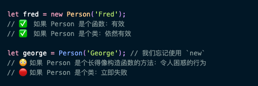
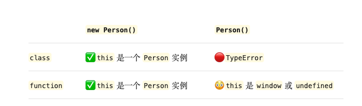

1. new 可以改变this 的指向

   

   

   如果`Person` 是普通的函数，如

   ```js
   function Person(name) {
     this.name = name;
   }
   var fred = new Person('Fred'); // ✅ Person {name: 'Fred'}
   var george = Person('George'); // 🔴 没用的，因为 this 会指向某个全局且无用的东西（比如，window 或者 undefined）
   ```

   

   

   


2. new 不能用于箭头函数

   ```js
   const Greeting = () => <p>Hello</p>;
   new Greeting(); // 🔴 Greeting 不是一个构造函数
   ```

   箭头函数的一个附带作用是它*没有*自己的 `this` 值 , 箭头函数没有 `prototype`

3. `new` 会妨碍 函数返回字符串或其它原始类型

```js
function Greeting() {
  return 'Hello';
}

Greeting(); // ✅ 'Hello'
new Greeting(); // 😳 Greeting {}
```

原因：`new` 告诉 JavaScript 引擎去创建一个对象，让这个对象成为函数内部的 `this`，然后把这个对象作为 `new` 的结果给我们。

