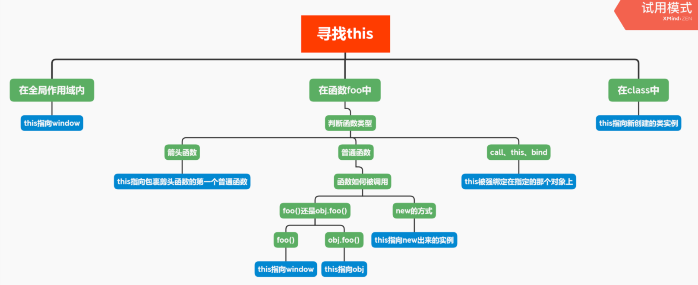

复习 this：

注意：ES6 的模块自动采用严格模式。严格模式主要有以下限制。

禁止`this`指向全局对象. ES6 模块之中，顶层的`this`指向`undefined`，即不应该在顶层代码使用`this`

学习文档：https://segmentfault.com/a/1190000008400124

四个规则：

1. 由`new`调用：绑定到新创建的对象
2. 由`call`或`apply`、`bind`调用：绑定到指定的对象
3. 由上下文对象调用：绑定到上下文对象
4. 默认：全局对象

注意：箭头函数不使用上面的绑定规则，根据外层作用域来决定`this`，继承外层函数调用的`this`绑定。

