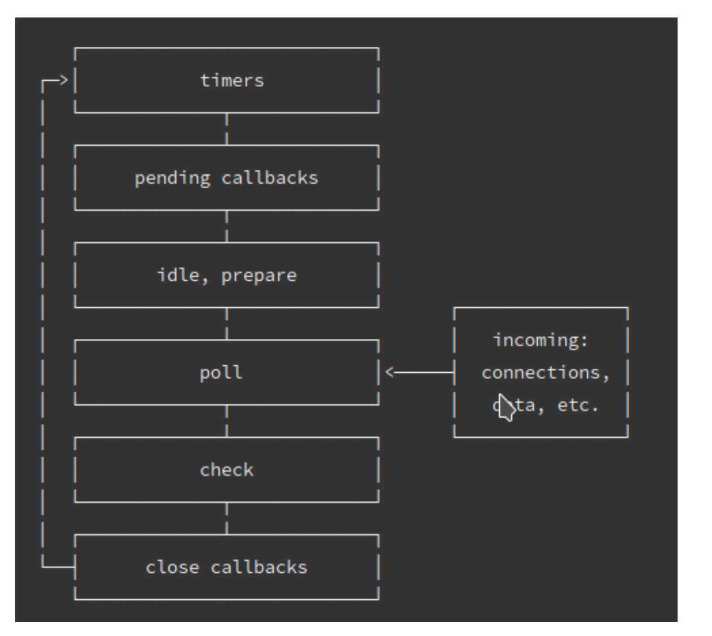

# 浏览器的事件循环

在`JavaScript`中，任务被分为两种，一种宏任务（`MacroTask`）也叫`Task`，一种叫微任务（`MicroTask`）

### MacroTask（宏任务）

- `script`全部代码、`setTimeout`、`setInterval`、`setImmediate`（浏览器暂时不支持，只有IE10支持，具体可见[`MDN`](https://developer.mozilla.org/zh-CN/docs/Web/API/Window/setImmediate)）、`I/O`、`UI Rendering`。

  

  ### MicroTask（微任务）

  - `Process.nextTick（Node独有）`、`Promise`、`Object.observe(废弃)`、`MutationObserver`（具体使用方式查看[这里](http://javascript.ruanyifeng.com/dom/mutationobserver.html)）


**关于微任务和宏任务在浏览器的执行顺序是这样的：**

- 执行一只task（宏任务）
- 执行完micro-task队列 （微任务)

```js
function test () {
   console.log('start')
    setTimeout(() => {
        console.log('children2')
        Promise.resolve().then(() => {console.log('children2-1')})
    }, 0)
    setTimeout(() => {
        console.log('children3')
        Promise.resolve().then(() => {console.log('children3-1')})
    }, 0)
    Promise.resolve().then(() => {console.log('children1')})
    console.log('end') 
}

test()

// 以上代码在node11以下版本的执行结果(先执行所有的宏任务，再执行微任务)
// start
// end
// children1
// children2
// children3
// children2-1
// children3-1

// 以上代码在node11及浏览器的执行结果(顺序执行宏任务和微任务)
// start
// end
// children1
// children2
// children2-1
// children3
// children3-1
```


# Node 的事件循环

Node的事件循环是libuv实现的，引用一张官网的图：



大体的task（宏任务）执行顺序是这样的：

- timers定时器：本阶段执行已经安排的 setTimeout() 和 setInterval() 的回调函数。
- pending callbacks待定回调：执行延迟到下一个循环迭代的 I/O 回调。
- idle, prepare：仅系统内部使用。
- poll 轮询：检索新的 I/O 事件;执行与 I/O 相关的回调（几乎所有情况下，除了关闭的回调函数，它们由计时器和 setImmediate() 排定的之外），其余情况 node 将在此处阻塞。
- check 检测：setImmediate() 回调函数在这里执行。
- close callbacks 关闭的回调函数：一些准备关闭的回调函数，如：socket.on('close', ...)。

**微任务和宏任务在Node的执行顺序**

Node 10以前：

- 执行完一个阶段的所有任务
- 执行完nextTick队列里面的内容
- 然后执行完微任务队列的内容

Node 11以后：
 和浏览器的行为统一了，都是每执行一个宏任务就执行完微任务队列。

