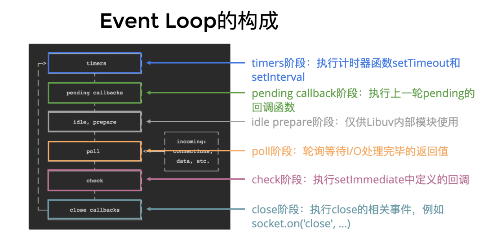
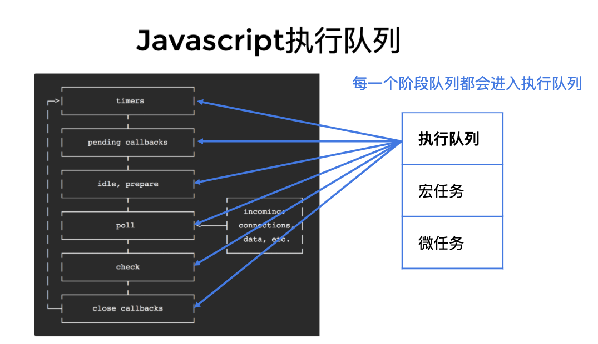

## 什么是事件循环？

事件循环是 Node.js 处理非阻塞 I/O 操作的机制——尽管 JavaScript 是单线程处理的——当有可能的时候，它们会把操作转移到系统内核中去。

_注意：每个框被称为事件循环机制的一个阶段。_

每个阶段都有一个 FIFO 队列来执行回调。虽然每个阶段都是特殊的，但通常情况下，当事件循环进入给定的阶段时，它将执行特定于该阶段的任何操作，然后执行该阶段队列中的回调，直到队列用尽或最大回调数已执行。当该队列已用尽或达到回调限制，事件循环将移动到下一阶段，等等。

>  宏任务和微任务都是任务队列，常见API 如下：
>
> + 宏任务：setTimeout, setInterval, setImmediate, I/O, UI rendering
> + 微任务：process.nextTick, Promise, MutationObserver*

##### 参考文档

1. https://juejin.cn/post/6844903607276437517*

2. https://laixiazheteng.com/article/page/id/H61NOVU0RZ9Y*