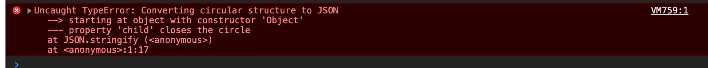

# 深拷贝

1. https://mp.weixin.qq.com/s/vXbFsG59L1Ba0DMcZeU2Bg

### 如何实现深拷贝？

#### 1. 用 `JSON.parse(JSON.stringify())`


问题：

1. 部分属性无法正常的拷贝

```js
const a={"a":"test","b":null, "c":undefined}

JSON.parse(JSON.stringify(a))
```

// 输出 ​{​a: "test", b: null}

\```

JSON在执行字符串化的这个过程时，会先进行一个JSON格式化，获得安全的JSON值，因此如果是非安全的JSON值，就会被丢弃掉。其中`undefined`、`function`、`symbol`这三种类型的值就是非安全的（包括该对象的属性循环赋值该对象），所以格式化后，就被过滤掉了，而`set`、`map`这种数据格式的对象，也并没有被正确处理，而是处理成了一个空对象。

2. 无法处理循环引用的问题

   ```js
   var data = {
       name: 'foo',
       child: null,
   }
   
   data.child = data
   Json.stringify(data) // throw error
   
   ```



####2. 用 Object.assign(target, source1, source2)

这个其实是浅拷贝的,demo

```js
var test = {  name: '张三' }
var data = { 
              a: 123,
              b: test
            }
var newData = Object.assign({},data)
console.log(newData) 
// {  a: 123,  b: {    name: '张三'  }}
test.age = 18
console.log(newData)
// {  a: 123,  b: {    name: '张三',   age: 18  }}

```


#### 3. 用递归的方式进行拷贝

demo：

