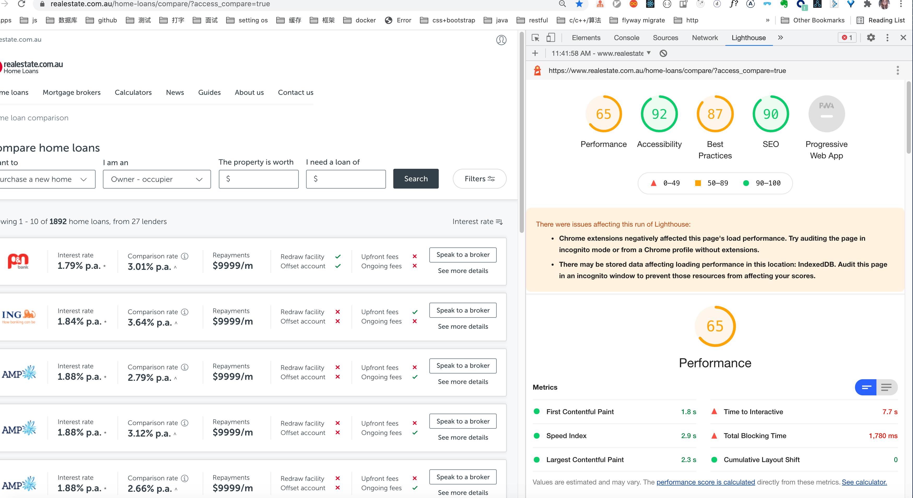
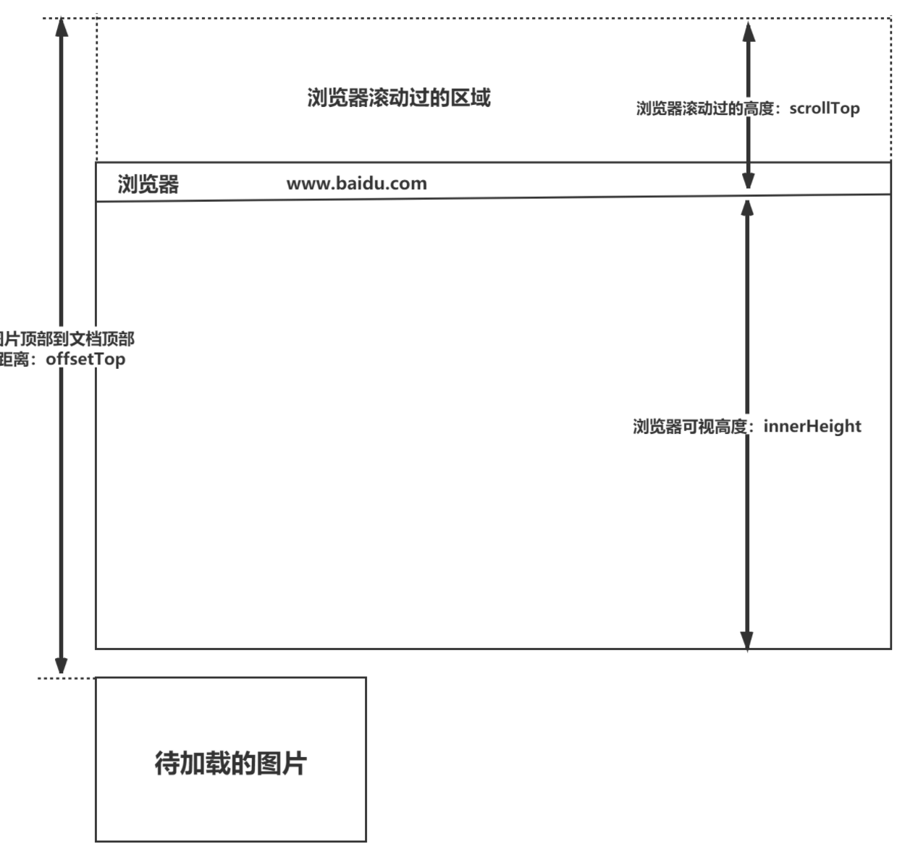

# 如何做性能优化？

性能优化都要遵循**两原则三步骤**

- 两原则：不去优化没有测试的软件（单元测试要有，不然优化出了bug都不知道）、不去优化你不了解的软件
- 三步骤：测试、分析、调优

## 1. 度量标准与设定目标

并不是所有指标都同样重要，这取决于你的应用。最后根据度量标准设定一个现实的目标

性能优化之法，曰立，曰测，曰理，曰拆，曰分，曰剥，曰拖，曰缓。

详见思维导图

#### 1.1 度量标准

+ **FP（全称“First Paint”，翻译为“首次绘制”）** 是时间线上的第一个“时间点”，它代表浏览器第一次向屏幕传输像素的时间，也就是页面在屏幕上首次发生视觉变化的时间。

+ **FCP（全称“First Contentful Paint”，翻译为“首次内容绘制”）**，顾名思义，它代表浏览器第一次向屏幕绘制 **“内容”**。

  > 注意：只有首次绘制文本、图片（包含背景图）、非白色的`canvas`或SVG时才被算作FCP。

  

  FP与FCP这两个指标之间的主要区别是：FP是当浏览器开始绘制内容到屏幕上的时候，只要在视觉上开始发生变化，无论是什么内容触发的视觉变化，在这一刻，这个时间点，叫做FP。

  相比之下，FCP指的是浏览器首次绘制来自DOM的内容。例如：文本，图片，SVG，canvas元素等，这个时间点叫FCP。

  > FP和FCP可能是相同的时间，也可能是先FP后FCP。

+ **FMP（全称“First Meaningful Paint”，翻译为“首次有效绘制”）** 表示页面的“主要内容”开始出现在屏幕上的时间点。它是我们测量用户加载体验的主要指标。

  FMP本质上是通过一个算法来猜测某个时间点可能是FMP，所以有时候不准。

+ **LCP（全称“Largest Contentful Paint”）** 表示可视区“内容”最大的可见元素开始出现在屏幕上的时间点。用来判断首屏有效绘制的时间，比FMP更精准

+ **TTI（全称“Time to Interactive”，翻译为“可交互时间”）** 表示网页第一次 **完全达到可交互状态** 的时间点。可交互状态指的是页面上的UI组件是可以交互的（可以响应按钮的点击或在文本框输入文字等），不仅如此，此时主线程已经达到“流畅”的程度，主线程的任务均不超过50毫秒。TTI很重要，因为TTI可以让我们了解我们的产品需要多久可以真正达到“可用”的状态。

+ 输入响应（Input responsiveness，界面响应用户输入所需的时间）

+ 速度指数（ Speed Index，简称SI，测量页面在加载过程中视觉上的变化速度，分数越低越好, 显示页面可见部分的平均时间（注意，是真正的可见，用户可以立马看见的，屏幕外的部分不算,它主要用于测量页面内容在视觉上填充的速度。

+ 英雄渲染时间（Hero Rendering Times，度量用户体验的新指标，当用户最关心的内容渲染完成）

+ Cumulative Layout Shift （**CLS** ): 衡量的是页面整个生命周期中每次元素发生的非预期布局偏移得分的总和。每次可视元素在两次渲染帧中的起始位置不同时，就说是发生了LS. 它量化了一个页面的内容在视觉上移动的程度。**CLS<0.1**，同样标准需要覆盖站点75%的用户才算良好

+ Total Blocking Time（TBT）:量化了负载响应能力。TBT衡量的是第一次有内容的绘画（FCP）和交互时间（TTI）之间的总时间。它是TTI的配套指标，它为量化主线程活动带来了更多的细微差别，这些活动阻碍了用户与您的页面进行交互的能力。 

+ 自定义指标，由业务需求和用户体验来决定。

  

FMP与英雄渲染时间非常相似，但它们不一样的地方在于FMP不区分内容是否有用，不区分渲染出的内容是否是用户关心的。


Google提出的网站用户体验的三大核心指标

LCP、FID、CLS

LCP 代表了页面的速度指标

FID 代表了页面的交互体验指标

CLS 代表了页面的稳定指标



### 1.2 设定目标

+ 100毫秒的界面响应时间与60FPS
+ 速度指标（Speed Index）小于1250ms
+ 3G网络环境下可交互时间小于5s
+ 重要文件的大小预算小于170kb


以上四种指标的设定都**有据可循**。详细信息请查看[RAIL](https://developers.google.com/web/fundamentals/performance/rail?hl=zh-cn)性能模型。

### 1.3 辅助Debug工具

+ Performance Monitor 性能检测监控器
+ Profile（React）探查器
+ Task manager 任务管理器
+ Lighthouse 
+ Chrome://tracking/ 追踪器

## 2. 优化办法

### 2.1 减少请求次数

    ####  2.1.1：CDN

CDN（Content Delivery Network，**内容分发网络**）是指一种通过互联网互相连接的电脑网络系统，利用最靠近每位用户的服务器，更快、更可靠地将音乐、图片、视频、应用程序及其他文件发送给用户，来提供高性能、可扩展性及低成本的网络内容传递给用户。

CDN一般会用来托管Web资源（包括文本、图片和脚本等），可供下载的资源（媒体文件、软件、文档等），应用程序（门户网站等）。使用CDN来加速这些资源的访问。

（1）在性能方面，引入CDN的作用在于：

- 用户收到的内容来自最近的数据中心，延迟更低，内容加载更快
- 部分资源请求分配给了CDN，减少了服务器的负载

（2）在安全方面，CDN有助于防御DDoS、MITM等网络攻击：

- 针对DDoS：通过监控分析异常流量，限制其请求频率
- 针对MITM：从源服务器到 CDN 节点到 ISP（Internet Service Provider），全链路 HTTPS 通信


除此之外，CDN作为一种基础的云服务，同样具有资源托管、按需扩展（能够应对流量高峰）等方面的优势。

### 2.1.2 缓存

+ 强缓存
+ 弱缓存


### 2.1.3 图片优化

对 chorme 来说，http 请求的最大并发数量是 6.

PC 端：PC 端主要是通过 wifi 来访问互联网的，如果一个网站的图片比较多(尤其是电商购物网站)，那么同一时间就会发起多个 http 并发请求，多个并发请求之间就会处于竞争的状态，页面打开的速度会大幅度下降。

Mobine: 手机端很多时候都是通过自己的移动流量进行互联网访问，这个时候我们就需要为用户考虑到流量的问题了，并且如果用户的网络情况不是很好，就需要在节省流量的前提下更快的把图片展示给用户。

平时比较常见的图片类型有：jpg、jpeg、png、svg、bmp、gif、webp


图片优化方式一：懒加载

图片优化方式二：图片压缩

JPG的压缩方式仍然是一种高质量的压缩方式：当我们把图片体积压缩至原有体积的 50% 以下时，JPG 仍然可以保持住 60% 的品质，JPG 适用于呈现色彩丰富的图片。JPG 图片经常作为大的背景图、轮播图或 Banner 图出现。缺点：它处理**矢量图形**和 **Logo**等线条感较强、颜色对比强烈的图像时，人为压缩导致的图片模糊会相当明显，此外，JPEG 图像不支持**透明度处理**，透明图片需要召唤 PNG 来呈现。


PNG：PNG 在处理线条和颜色对比度方面的优势，我们主要用它来呈现小的 Logo、颜色简单且对比强烈的图片或背景等。缺点：体积太大是唯一的BUG

SVG：矢量图，适合做logo,  缺点：一方面是它的渲染成本比较高，另一方面，SVG 存在着其它图片格式所没有的学习成本（它是可编程的 )


Base 64: 并非一种图片格式，而是一种编码方式。做非常小的logo. 如果大图也换成 base 64, 图片大小会膨胀为原文件的 4/3（这是由 Base64 的编码原理决定的）。如果我们把大图也编码到 HTML 或 CSS 文件中，后者的体积会明显增加，即便我们减少了 HTTP 请求，也无法弥补这庞大的体积带来的性能开销，得不偿失。 在传输非常小的图片的时候，Base64 带来的文件体积膨胀、以及浏览器解析 Base64 的时间开销，与它节省掉的 HTTP 请求开销相比，可以忽略不计，这时候才能真正体现出它在性能方面的优势。

Base64 并非万全之策，我们往往在一张图片满足以下条件时会对它应用 Base64 编码：

- 图片的实际尺寸很小
- 图片无法以雪碧图的形式与其它小图结合（合成雪碧图仍是主要的减少 HTTP 请求的途径，Base64 是雪碧图的补充）
- 图片的更新频率非常低（不需我们重复编码和修改文件内容，维护成本较低）

Webp: 在无损压缩的情况下，相同质量的WebP图片，文件大小要比PNG小26%；
在有损压缩的情况下，具有相同图片精度的WebP图片，文件大小要比JPEG小25%~34%；
缺点：兼容性差，WebP 还会增加服务器的负担——和编码 JPG 文件相比，编码同样质量的 WebP 文件会占用更多的计算资源。现在限制我们使用 WebP 的最大问题不是“这个图片是否适合用 WebP 呈现”的问题，而是“浏览器是否允许 WebP”的问题，即我们上文谈到的兼容性问题


雪碧图：CSS精灵, 将小图标和背景图像合并到一张图片上，从而减少你的网站的HTTP请求数量 ,然后利用css的背景定位来显示需要显示的图片部分。

#####  如何对项目中的图片进行优化？

1. 不用图片。很多时候会使用到很多修饰类图片，其实这类修饰图片完全可以用 CSS 去代替。
2. 对于移动端来说，屏幕宽度就那么点，完全没有必要去加载原图浪费带宽。一般图片都用 CDN 加载，可以计算出适配屏幕的宽度，然后去请求相应裁剪好的图片。
3. 小图使用 base64 格式
4. 将多个图标文件整合到一张图片中（雪碧图）
5. 选择正确的图片格式：
   - 对于能够显示 WebP 格式的浏览器尽量使用 WebP 格式。因为 WebP 格式具有更好的图像数据压缩算法，能带来更小的图片体积，而且拥有肉眼识别无差异的图像质量，缺点就是兼容性并不好
   - 小图使用 PNG，其实对于大部分图标这类图片，完全可以使用 SVG 代替
   - 照片使用 JPEG


### 2.1.4节流防抖

+ 防抖：是指在事件被触发 n 秒后再执行回调，如果在这 n 秒内事件又被触发，则重新计时。这可以使用在一些点击请求的事件上，避免因为用户的多次点击向后端发送多次请求。

  使用场景：

  A： 按钮提交场景：防⽌多次提交按钮，只执⾏最后提交的⼀次

  B:  服务端验证场景：表单验证需要服务端配合，只执⾏⼀段连续的输⼊事件的最后⼀次，还有搜索联想词功能类似⽣存环境请⽤lodash.debounce

  

+ 节流： 节流是指规定一个单位时间，在这个单位时间内，只能有一次触发事件的回调函数执行，如果在同一个单位时间内某事件被触发多次，只有一次能生效。节流可以使用在 scroll 函数的事件监听上，通过事件节流来降低事件调用的频率。

  使用场景：

  A：拖拽场景：固定时间内只执⾏⼀次，防⽌超⾼频次触发位置变动

  B： 缩放场景：监控浏览器resize

  C：动画场景：避免短时间内多次触发动画引起性能问题

  

### 2.2 减少请求的体积

#### 2.2.1 资源压缩


### 2.3 服务器发送HTTP 响应时间

#### 2.3.1 利用CDN（高流量大并发情况下，减少响应时间

#### 2.3.2 降低页面初始渲染时间

+ 预渲染
+ SSR


### 2.3 页面渲染

#### 2.3.1 减少阻塞

+ 减少js 阻塞
+ 减少css 阻塞

#### 2.3.2 减少渲染次数

+ 避免回流和重绘

  ##### 回流

  当渲染树中部分或者全部元素的尺寸、结构或者属性发生变化时，浏览器会重新渲染部分或者全部文档的过程就称为**回流**。

  下面这些操作会导致回流：

  - 页面的首次渲染
  - 浏览器的窗口大小发生变化
  - 元素的内容发生变化
  - 元素的尺寸或者位置发生变化
  - 元素的字体大小发生变化
  - 激活CSS伪类
  - 查询某些属性或者调用某些方法
  - 添加或者删除可见的DOM元素

  ##### 重绘

  当页面中某些元素的样式发生变化，但是不会影响其在文档流中的位置时，浏览器就会对元素进行重新绘制，这个过程就是**重绘**。

  下面这些操作会导致回流：

  - color、background 相关属性：background-color、background-image 等
  - outline 相关属性：outline-color、outline-width 、text-decoration
  - border-radius、visibility、box-shadow

  注意： **当触发回流时，一定会触发重绘，但是重绘不一定会引发回流。**

  浏览器针对页面的回流与重绘，进行了自身的优化——**渲染队列**

  **浏览器会将所有的回流、重绘的操作放在一个队列中，当队列中的操作到了一定的数量或者到了一定的时间间隔，浏览器就会对队列进行批处理。这样就会让多次的回流、重绘变成一次回流重绘。**

  上面，将多个读操作（或者写操作）放在一起，就会等所有的读操作进入队列之后执行，这样，原本应该是触发多次回流，变成了只触发一次回流。

  ##### 优化动画

  对于如何优化动画，我们知道，一般情况下，动画需要频繁的操作DOM，就就会导致页面的性能问题，我们可以将动画的`position`属性设置为`absolute`或者`fixed`，将动画脱离文档流，这样他的回流就不会影响到页面了。

#### 2.3.3 减少渲染的节点数量

##### 懒加载

懒加载也叫做延迟加载、按需加载，指的是在长网页中延迟加载图片数据，是一种较好的网页性能优化的方式，让浏览器同一时间的并发数减少。

特点：

+ **减少无用资源的加载**

+ **提升用户体验**

+ **防止加载过多图片而影响其他资源文件的加载** 



方法一：

```html
<div class="container">
     
     
     
     
     
     
</div>
<script>
var imgs = document.querySelectorAll('img');
function lozyLoad(){
		var scrollTop = document.body.scrollTop || document.documentElement.scrollTop;
		var winHeight= window.innerHeight;
		for(var i=0;i < imgs.length;i++){
			if(imgs[i].offsetTop < scrollTop + winHeight ){
				imgs[i].src = imgs[i].getAttribute('data-src');
			}
		}
	}
  window.onscroll = lozyLoad();
</script>
```


方法二：Intersection Observer

使用API Intersection Observer，它可以不用监听scroll事件，只要元素一可见便调用回调，在回调里面我们来调用对应的元素可见时的处理逻辑。

```js
if ("IntersectionObserver" in window) {        
    let lazyImageObserver = new IntersectionObserver((entries, observer) => {          
        entries.forEach((entry, index) => {            
            // 如果元素可见            
            if (entry.intersectionRatio > 0) {              
                let lazyImage = entry.target              
                lazyImage.src = lazyImage.dataset.src              
                lazyImage.classList.remove("lazy-image")              
                lazyImageObserver.unobserve(lazyImage)              
                // this.lazyImages.splice(index, 1)            
            }          
        })        
    })        
    this.lazyImages.forEach(function(lazyImage) {          
        lazyImageObserver.observe(lazyImage);        
    })      
}
```


##### 预加载

**预加载指的是将所需的资源提前请求加载到本地，这样后面在需要用到时就直接从缓存取资源。** 通过预加载能够减少用户的等待时间，提高用户的体验。我了解的预加载的最常用的方式是使用 js 中的 image 对象，通过为 image 对象来设置 scr 属性，来实现图片的预加载。


#### 2.3.4 提高渲染效率

+ 减少DOM 节点的操作
+ 降低选择器的复杂性
+ 避免强制同步布局和布局抖动
+ 内联首屏关键CSS

### 2.4 构建优化

#### 2.4.1 webpack 优化

### 2.5 其它

