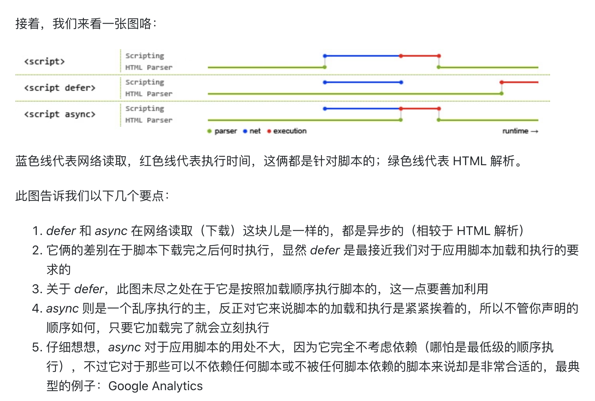

## async 和 defer 的作用是什么?有什么区别?(浏览器解析过程)

1. 脚本没有 defer 或 async，浏览器会立即加载并执行指定的脚本，也就是说不等 待后续载入的文档元素，读到就加载并执行。
2. defer 属性表示延迟执行引入的 JavaScript，即这段 JavaScript 加载时 HTML 并 未停止解析，这两个过程是并行的。当整个 document 解析完毕后再执行脚本文件，在 DOMContentLoaded 事件触发之前 完成。多个脚本按顺序执行。

3. async 属性表示异步执行引入的 JavaScript，与 defer 的区别在于，如果已经加 载好，就会开始执行，也就是说它的执行仍然会阻塞文档的解析，只是它的加载过程不会阻 塞。多个脚本的执行顺序无法保证。

