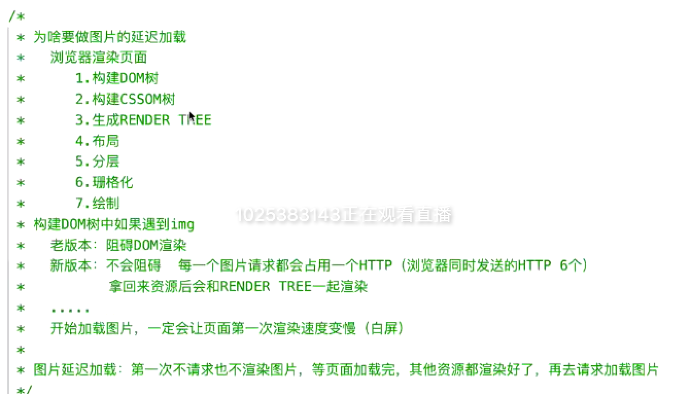
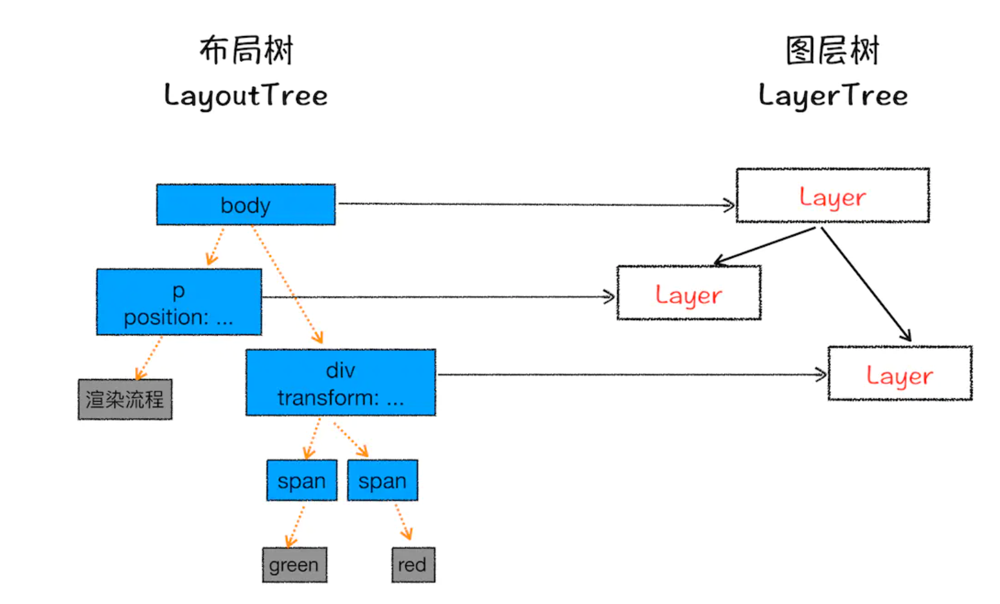
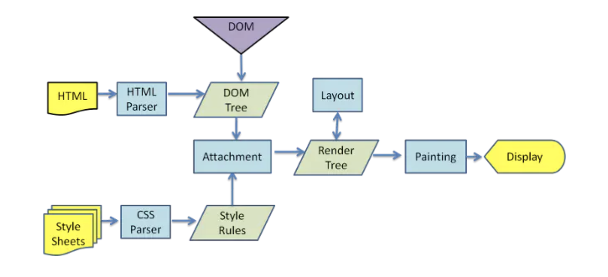
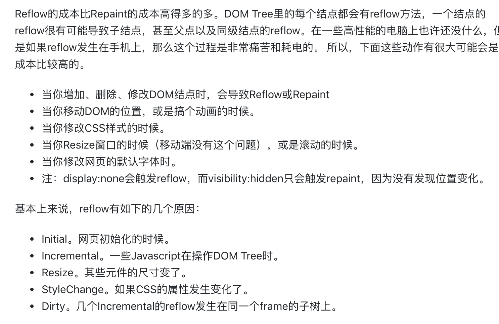
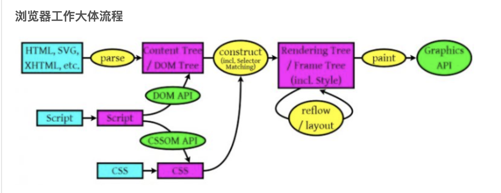

1. 浏览器解析 html 源码，然后创建一个 DOM 树。并行请求 css/image/js 在 DOM 树中，每一个 HTML 标签都有一个对应的节点，并且每一个文本也都会有一个对应的文本节点。DOM 树的根节点就是 documentElement，对应的是 html 标签。
2. 浏览器解析 CSS 代码，计算出最终的样式数据。构建 CSSOM 树。对 CSS 代码中非法的语法它会直接忽略掉。解析 CSS 的时候会按照如下顺序来定义优先级：浏览器默认设置 < 用户设置 < 外链样式 < 内联样式 < html 中的 style。
3. DOM Tree + CSSOM --> 渲染树（rendering tree）。渲染树和 DOM 树有点像，但是是有区别的。

   DOM 树完全和 html 标签一一对应，但是渲染树会忽略掉不需要渲染的元素，比如 head、display:none 的元素等。而且一大段文本中的每一个行在渲染树中都是独立的一个节点。渲染树中的每一个节点都存储有对应的 css 属性。

4. 布局：通过渲染树中渲染对象的信息，计算出每一个渲染对象的位置和尺寸，将其安置在浏览器窗口的正确位置，而有些时候我们会在文档布局完成后对 DOM 进行修改，这时候可能需要重新进行布局，也可称其为回流，本质上还是一个布局的过程，每一个渲染对象都有一个布局或者回流方法，实现其布局或回流。

5. 分层：因为页面中有很多复杂的效果，如一些复杂的 3D 变换、页面滚动，或者使用 z-index 做 z 轴排序等，为了更加方便地实现这些效果，渲染引擎还需要为特定的节点生成专用的图层，并生成一棵对应的图层树（LayerTree）。

   

#### 6. 栅格化（raster）操作

通常一个页面可能很大，但是用户只能看到其中的一部分，我们把用户可以看到的这个部分叫做视口（viewport）

合成线程会按照视口附近的图块来优先生成位图，实际生成位图的操作是由栅格化来执行的。所谓栅格化，是指将图块转换为位图。

7. #### 合成和显示(绘制)

   一旦所有图块都被光栅化，合成线程就会生成一个绘制图块的命令——“DrawQuad”，然后将该命令提交给浏览器进程。

   浏览器进程里面有一个叫 viz 的组件，用来接收合成线程发过来的 DrawQuad 命令，然后根据 DrawQuad 命令，将其页面内容绘制到内存中，最后再将内存显示在屏幕上。

1. 绘制：在绘制阶段，系统会遍历呈现树，并调用呈现器的“paint”方法，将呈现器的内容显示在屏幕上。绘制工作是使用用户界面基础组件完成的。

   绘制的顺序其实就是元素进入堆栈样式上下文的顺序。这些堆栈会从后往前绘制，因此这样的顺序会影响绘制。块呈现器的堆栈顺序如下：

   - 背景颜色

   - 背景图片

   - 边框

   - 子代

   - 轮廓

   Reflow 和 Repaint 的区别：

   **Repaint** ——屏幕的一部分要重画，比如某个 CSS 的背景色变了。但是元素的几何尺寸没有变。

   **Reflow** 元件的几何尺寸变了，我们需要重新验证并计算 Render Tree。是 Render Tree 的一部分或全部发生了变化。这就是 Reflow，或是 Layout。

### 合成

直接合成阶段，使用了 CSS 的 transform 来实现动画效果，这可以避开重排和重绘阶段，直接在非主线程上执行合成动画操作。这样的效率是最高的，因为是在非主线程上合成，并没有占用主线程的资源，另外也避开了布局和绘制两个子阶段，所以相对于重绘和重排，合成能大大提升绘制效率。

> 一个完整的渲染流程大致可总结为如下：
>
> 1. 渲染进程将 HTML 内容转换为能够读懂的 DOM 树结构。
> 2. 渲染引擎将 CSS 样式表转化为浏览器可以理解的 styleSheets，计算出 DOM 节点的样式。
> 3. 创建布局树，并计算元素的布局信息。
> 4. 对布局树进行分层，并生成分层树。
> 5. 为每个图层生成绘制列表，并将其提交到合成线程。
> 6. 合成线程将图层分成图块，并在光栅化线程池中将图块转换成位图。
> 7. 合成线程发送绘制图块命令 DrawQuad 给浏览器进程。
> 8. 浏览器进程根据 DrawQuad 消息生成页面，并显示到显示器上。

问题：在平时开发中如何减少重绘重排？

1. 使用 class 操作样式，而不是频繁操作 style
2. 避免使用 table 布局
3. 批量 dom 操作，例如 createDocumentFragment，或者使用框架（框架使用虚拟 DOM 技术最小化操作 DOM）。
4. window resize 这种触发概率频繁的事件要做节流

参考文档：

- https://blog.fundebug.com/2019/01/03/understand-browser-rendering/
