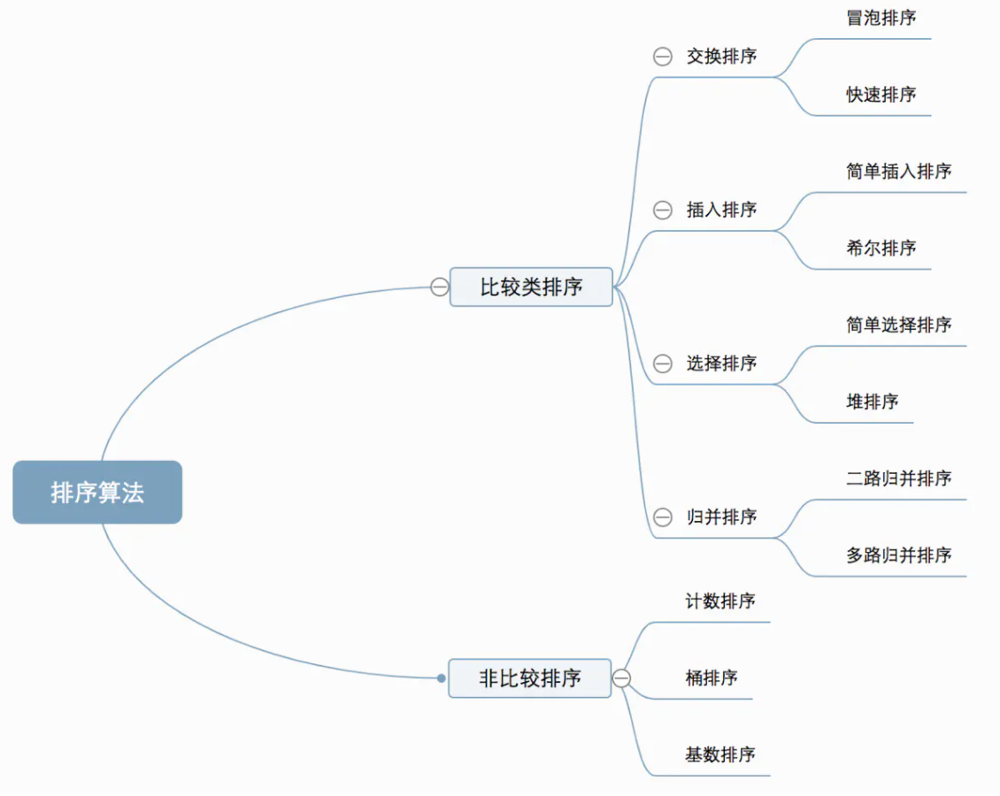

来源于文章：https://juejin.cn/post/6844903865859440647

### 1、冒泡排序

在待排序序列中选两相邻记录的数字，如果反序则交换，直到没有反序的数列为止。

### 2. **快速排序**，

对冒泡排序的一种改进。在快速排序中，记录的比较和移动的是从两端向中间进行，数值大的记录一次就能从前面移动到后面，数值小的记录一次就能从后面移动到前面，从而减少了总的比较次数和移动次数。

快速排序使用分治法把一个数列（list）分为2个数列（sub-lists），具体算法如下：

- 从数列中挑出一个元素，称为 “基准”（pivot）；
- 重新排序数列，所有元素比基准值小的摆放在基准前面，所有元素比基准值大的摆在基准的后面（相同的数可以到任一边）。在这个分区退出之后，该基准就处于数列的中间位置。这个称为分区（partition）操作；
- 递归地（recursive）把小于基准值元素的子数列和大于基准值元素的子数列排序。

